# 阿里云可观测智能化探索——从智能告警到利用 LLM 实现自然语言转 PromQL

<small style="color:gray">2024-07-24</small>

随着 IT 系统的复杂性日益增加，运维和监控领域面临的挑战也随之增长。AIOps 已成为解决这些挑战的有力工具，能够帮助自动化和优化监控流程，并显著提高效率。

在 6 月的深圳 ArchSummit 架构师峰会上，来自阿里云高级算法工程师陈昆仪博士，分享了关于阿里云在可观测智能化上的探索与实践，探讨了智能算法在系统异常检测和故障根因定位方面的应用，如推荐告警阈值、时序预测算法、定位异常服务以及分析错误或缓慢的调用链。此外，还将介绍如何利用 LLM 将自然语言自动转换为 Prometheus 查询语言（PromQL）的技术，简化了查询构建的过程。（以下是演讲整理）

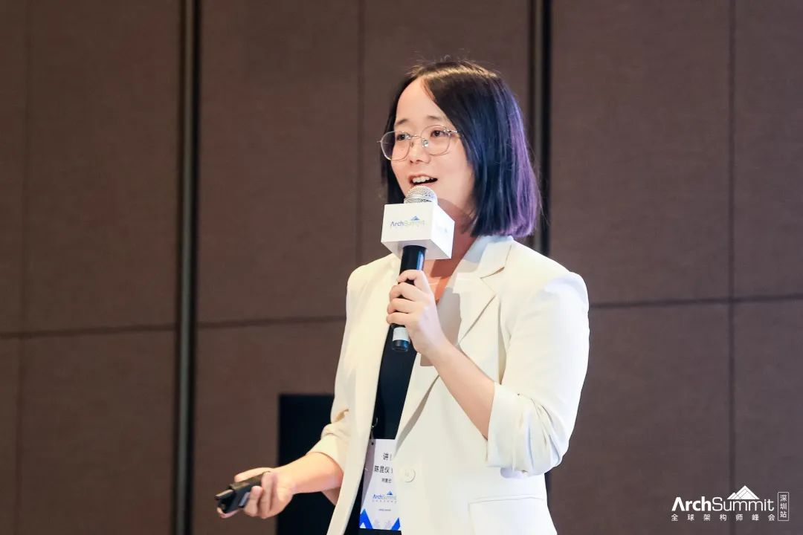

我是来自阿里云可观测团队的高级算法工程师，我将从算法工程师的视角来介绍整个 AIOps 在阿里云可观测中的落地和实践。

今天的分享将涵盖以下几个模块：首先是简要介绍 AIOps 能够解决的问题，我们将从一个告警说起。接下来是 AIOps 在系统异常检测和故障根因定位方面的应用，最后是我们在大语言模型方面的探索和实践。

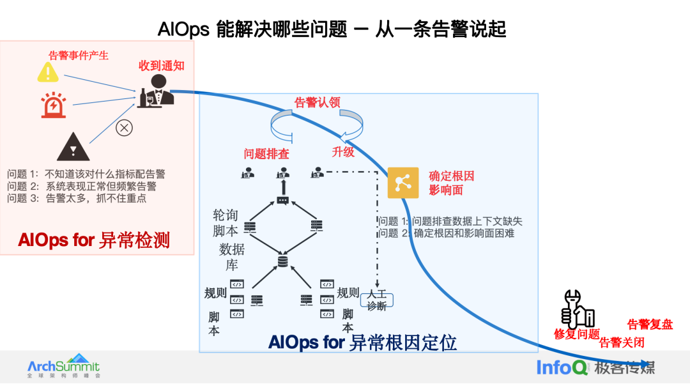

我们先来看一下 AIOps 在智能告警中的应用。从一个熟悉的告警入手。某位同事正在愉快地吃饭时收到了一个告警事件。他会首先进行告警认领和问题排查，这个过程可能需要几分钟，也可能需要几天甚至几个月。接下来，他会确定根因和影响范围，决定是否需要回滚，解决问题或修复 bug，最后关闭告警并进行告警复盘。表面上看，这个过程似乎很简单，但在现实中非常复杂。

首先，在配置告警时，我们往往不知道要对哪些指标配置告警。此外，许多系统在正常运行时也会产生大量告警，这些告警需要降噪和聚合。对于微服务架构的系统，尤其是像淘宝这种拥有数千个微服务的系统，一个下游应用的问题可能会引发大量告警，难以找到重点。另一个难点在于确定根因和影响范围，这是一个非常复杂的问题。

那么，AIOps 能为大家解决什么问题呢？首先是异常检测，我们帮助开发和运维人员更好地配置阈值，包括静态阈值和动态阈值，以及基于算法和模型的异常检测。其次是 AIOps for 异常根因定位，无论在学术界还是工业界，国内外都有很多研究和实践。AIOps 主要解决这两大问题。接下来，我将详细介绍 AIOps 在系统异常检测中的应用。

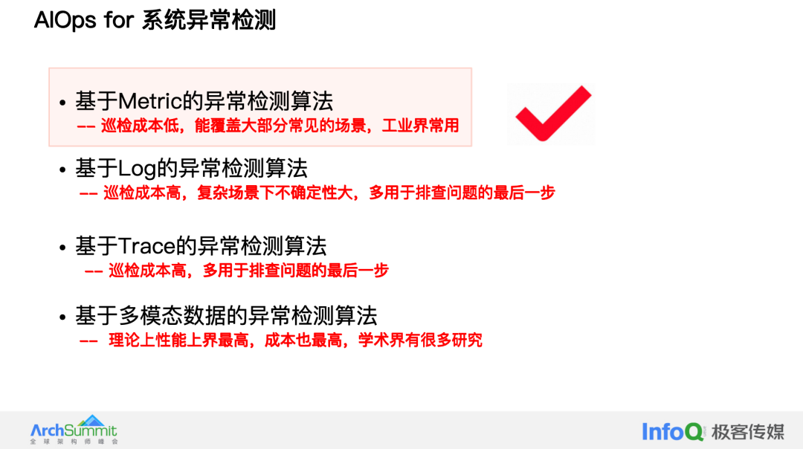

我们先说一下总体的情况：异常检测的算法可以大致分为四类。第一类是基于指标的异常检测，成本最低，能够覆盖大部分场景，是工业界最常用的。第二类是基于日志的异常检测算法。日志的复杂性和数量往往非常大，用日志进行异常检测的成本在工业界几乎是不可接受的，除非采用基于关键词识别的方法，例如检测到 error 或 exception 时触发告警。然而，更高级的日志异常检测算法需要提取大量的模板，并分析日志模式。当出现新的错误模式或某个模式的计数显著变化时，触发告警。虽然这种方法的成本较高，但其上限也较高。

第三类是基于 trace 的异常检测算法，这类算法的成本也很高。trace 通常用于定位非常细节的问题，一般不会直接对 trace 进行异常检测。第四类是学术界常见的基于多模态数据的异常检测算法，这类算法的理论性能最高，但成本也最高。即使我们能够接受高算力成本，客户未必愿意承担由延迟带来的成本。刚才有位同事提到，如果对大量的 trace 进行异常检测，所需的时间也会成为一个现实问题。

从阿里云的实际应用角度来看，我们推荐基于指标的异常检测算法。它的成本低，能够覆盖大部分常见场景，是工业界常用的一种方法。

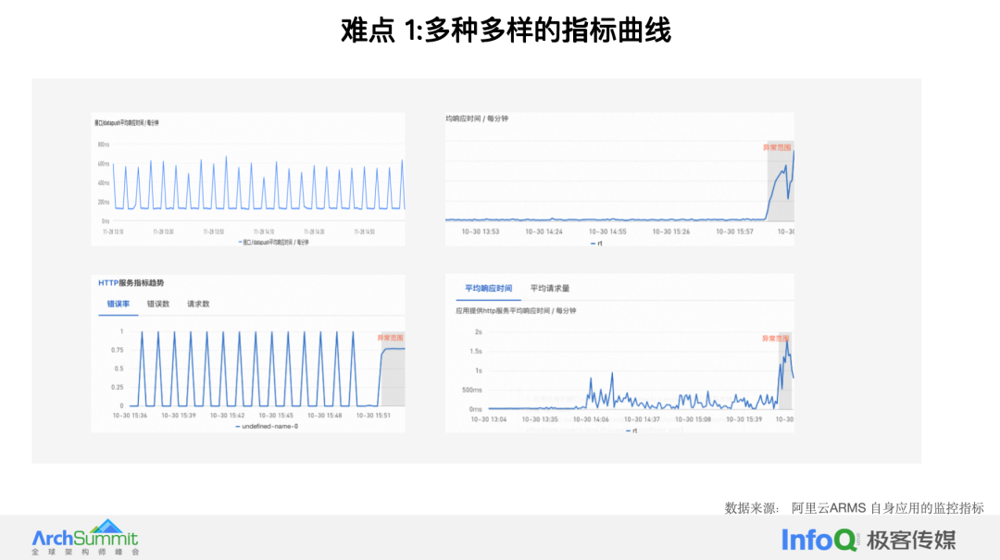

然后我来介绍一下这些难点，第一个就是各种各样的指标曲线，这个也是一个老生常谈的问题，仅仅是平均响应时间这一种指标，就会出现多种不同的曲线形态，我们把不同形态成为不同的 pattern。然后我们要对这么多种指标做这个异常巡检的话，其实误报率也有可能引发非常多的误告警，解决办法我后面会说。

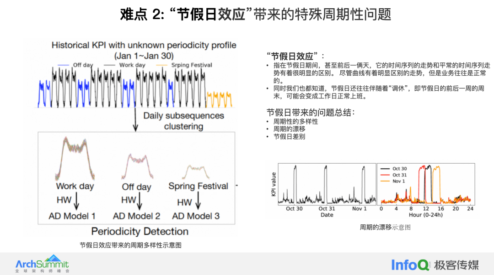

第二个问题是节假日效应带来的特殊关注。节假日效应指的是调用量在工作日和休息日之间呈现出不同的模式。例如，对于打车平台和共享单车平台，工作日的调用量通常远高于节假日的调用量。此外，在特殊节日如春节期间，调用量会显著下降。如果使用普通的异常检测算法，可能会导致误报。一般来说，检测算法会先进行预测，然后再进行检测。如果仅基于工作日的模式来预测周末的模式，容易引发误报。

直播平台也存在类似问题，例如在大主播上线时，会出现非常不同寻常的流量模式。我们还有一个出海客户，他们在对 QPS 指标进行预测和异常检测时也遇到了类似问题。他们的客户中有很多是穆斯林，而穆斯林每天的祷告时间不固定，导致流量在祷告期间突然下降。由于这些原因，他们常常因为小问题被叫起来检查系统是否正常。

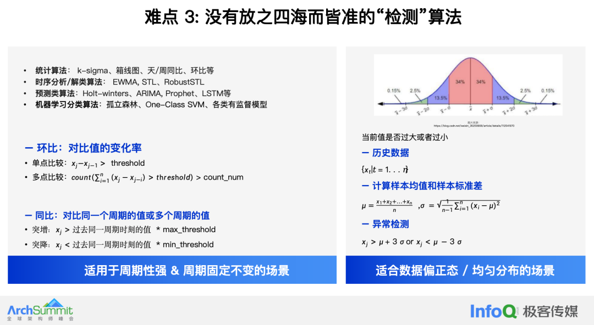

下一个问题其实是，前面提到的两个难点决定了目前无论是学术界还是工业界，还没有找到一种通用的检测算法。可以将检测算法分为几类：统计算法、时序预测分解类算法、机器学习算法等。这些算法各自适用于不同的场景。

例如，最简单、最基础的 k-Sigma 算法在处理 CPU 使用率、磁盘使用率、成功率、失败率等方面表现较好。预测类算法通常在处理流量型指标（如 QPS）时效果较好，可以解决一些统计算法无法解决的问题。经过实际应用，预测类算法也被证明是一个有效的解决方案。

此外，一些研发人员使用较为经典、传统的算法，比如同比算法。很多客户的告警阈值就是这样配置的，但在现实生活中会带来很多问题。举个例子，有个客户配置了一个环比算法：如果当前的调用量比前 5 分钟的调用量下降了 30%，就会触发严重告警。然而，某天晚上，该客户的订单系统在凌晨 3 点收到一单，之后长时间没有订单，结果系统立即触发大量告警。这就是现实中的问题。

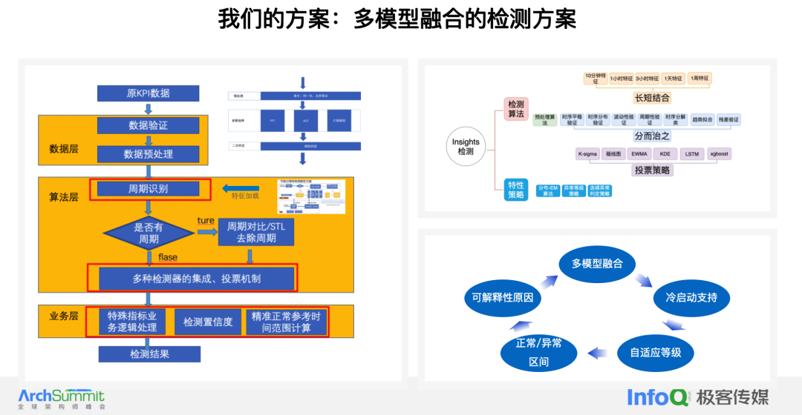

我们的方案其实在思路上比较简单直接，细节也不复杂。我们采用融合多种模型的方法来进行检测。为了应对节假日效应，这不仅包括天周期的节假日，还涵盖小时级别和分钟级别的周期性变化。我们会对时间序列提取不同的特征，例如 10 分钟特征、一小时特征、三小时特征、一天特征和一周特征。如果某个时间点对前面的数据来说是一个突增，但每天这个时间点都会出现相似情况，那么它就不应该触发告警。

此外，我们综合使用多种算法。首先，对指标进行分类：如果是平稳型曲线，适用于某种算法；如果是周期性或季节性较强的，适用于另一种算法；如果没有明显特征，就采用普通的机器学习算法。通过对不同算法的投票策略进行综合考虑，例如，第一个算法认为有问题，第二个算法认为没有问题，最终得到一个综合结果。这样做的好处是，一方面可以大幅减少误告警，另一方面当检测出问题时，我们也能明确是哪种算法识别出了问题。这使得我们在修复和维护时更加方便。

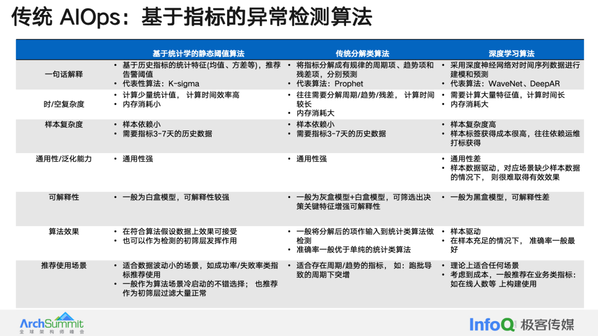

这是我们对一个传统 AIOps 基于这种指标的异常检测算法的一个比较大的 summary 时间关系，也比较常见。

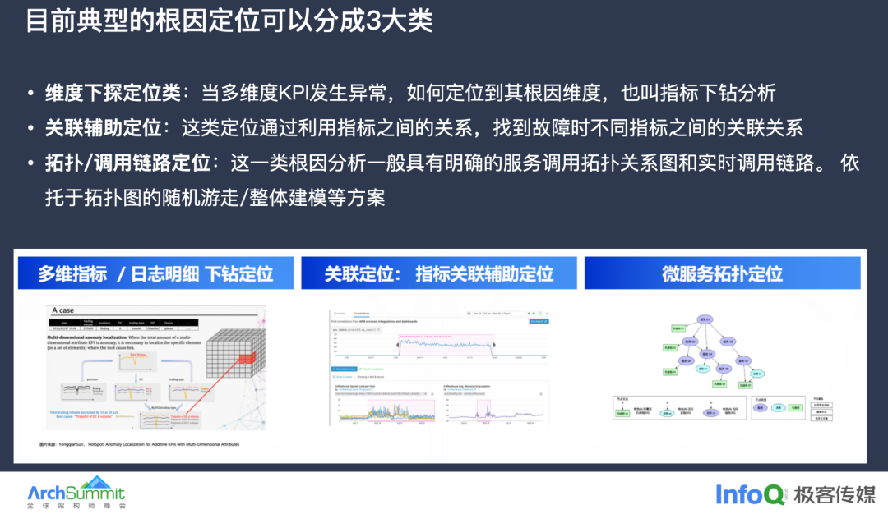

接下来我要介绍的是 AIOps 在故障根因定位中的应用。实际上，这里的算法可以分为三类。第一类是维度下探定位类算法，当多维度的 KPI 发生异常时，如何定位到根因维度。这方面的研究在学术界和工业界都有许多尝试，较经典的一类是利用曲线对比。如果熟悉 Prometheus 和 Grafana，可以看到我们的那些指标（metric）实际上都打了不同的标签。例如，我的 RT（响应时间）是来自哪个主机、哪个应用、哪个接口。如果使用容器，还会包括 Pod ID。应用整体的指标往往是多条最细粒度的 metric 的总和。如果整体错误率或响应时间发生突增，由于这些指标是多个细粒度指标的总和，那么问题肯定是由某一个具体的细粒度指标引发的。

我们在这方面也做了许多工作，这一类算法的核心思想是，当一个汇总维度的 metric 发生突增或突降时，应该能够追溯到具体的组合引发了这次异常。这类算法包括 attributor、Squeeze 和 Hotspot 等等。

第二类是关联辅助定位算法，它主要利用指标之间的关系。总的来说，就是计算指标之间的关联度。如果某个指标在一段时间内持续增长，应该能够关联到与其标签相关的其他 metric，然后检查是否由这些指标引发了故障。

最后一类是我们自己实践中发现最有效的，即利用拓扑和调用链路进行定位。当系统已经记录了大量的 trace，我们可以根据实时调用关系，发现当上游应用出现问题时，是由哪个子服务引发的。通过不断向下追溯，最终定位到具体的子服务。实际上，这个过程可能会涉及上百甚至几千个服务。

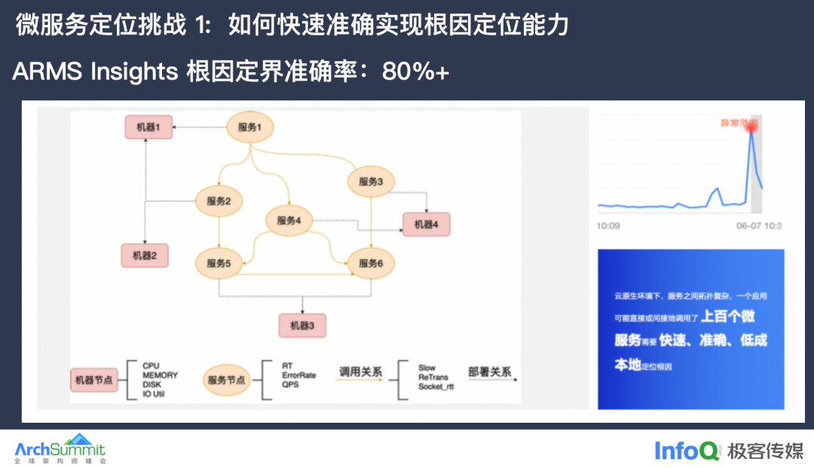

这是我们 ARMS Insights 的自动根因定位能力，其准确率可以达到 80% 以上。它解决的问题是，在云原生环境下，微服务架构的一个应用可能直接或间接地调用成百上千个服务。我们需要以快速、准确、低成本的方式定位根因。例如，服务 1 调用了服务 2、3 和 4，服务 4 又调用了服务 5 和 6，并且这些服务部署在不同的主机上。当上游应用发生异常时，我们需要确定最根本的原因。可能是服务 5 的响应时间（RT）突增，引发了服务 1 的异常。这种情况下，服务 5 的 RT 突增可能是由于其部署的那台机器上的流量爆发所致。

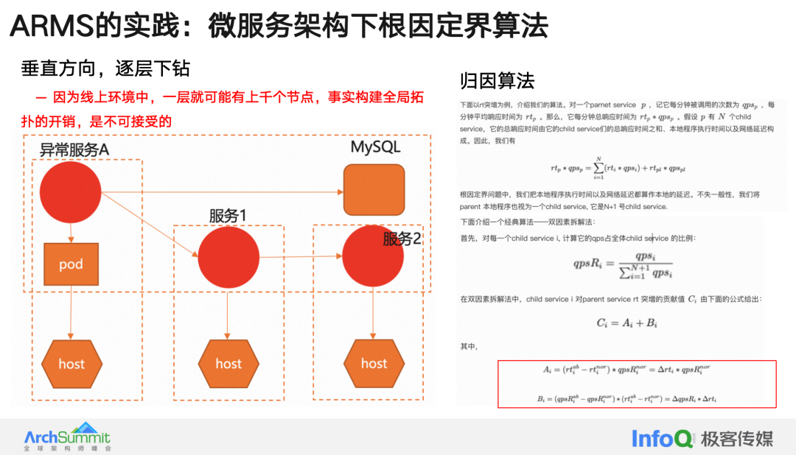

如何快速从上游应用定位到最下层的根因？我们采用了一个非常简单且实用的算法，并通过线上案例测试，准确率达到了 89.6%。我们的思路是在垂直方向上逐层下钻。在每一层下钻时，我们利用归因算法保留最有可能导致异常的几个业务，再继续往下钻取。这种逐层下钻的方法相比于一些其他尝试，如一开始就提取整个调用拓扑并使用随机游走算法进行分析，具有明显的优势。这种方法不仅延时较低、成本更低，而且准确率更高。

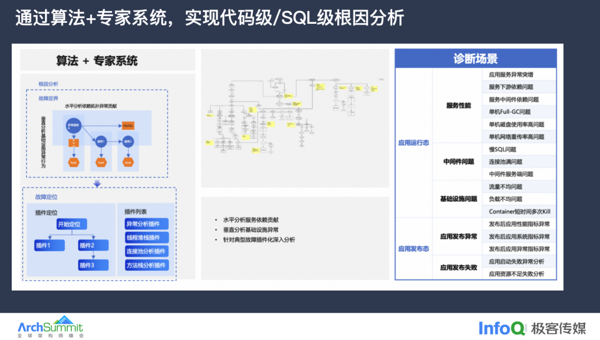

关于上面的根因定位，我们可以精确到服务级别，但如果要定位到代码级别或 SQL 级别，则需要更多的信息。例如，需要异常分析插件或数据库分析插件等额外工具。之前，我们的开发团队硬编码了一棵大型的决策树，用于根据具体情况进行检查，比如判断是否是一台 ECS 或 ACK，或者是其他服务。如果需要更细粒度的定位，例如方法级别，可以通过开启 profiling 来实现。这些规则虽然有效且精准，甚至比直接使用算法或大模型更可靠，但也存在明显的问题：引入新的场景时成本较高，并且可能影响之前场景的准确性。

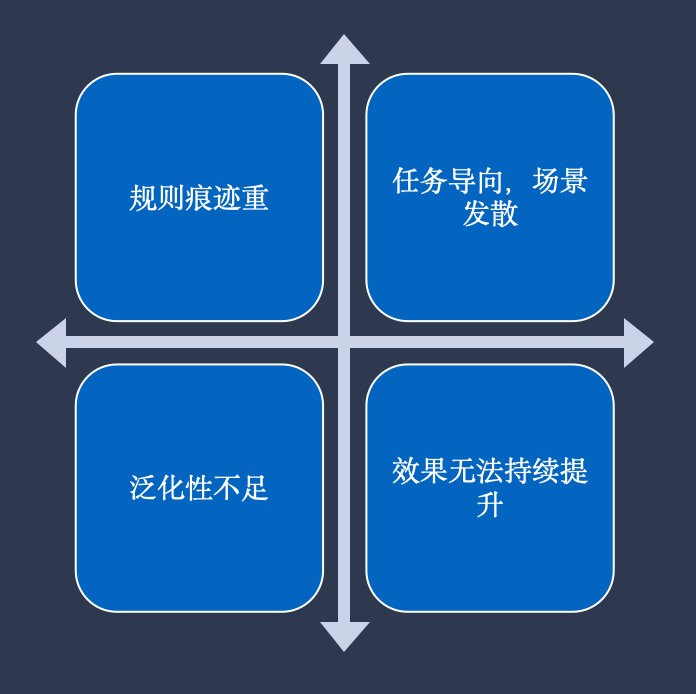

我们也尝试了一些用大模型的方式来解决这个通用性的问题，尝试下来比较靠谱的思路，引用今年清华的数据库一篇论文，也做了非常多的优化，利用大模型做 RCA 其实思路都一样，就是先有一个运维手册。

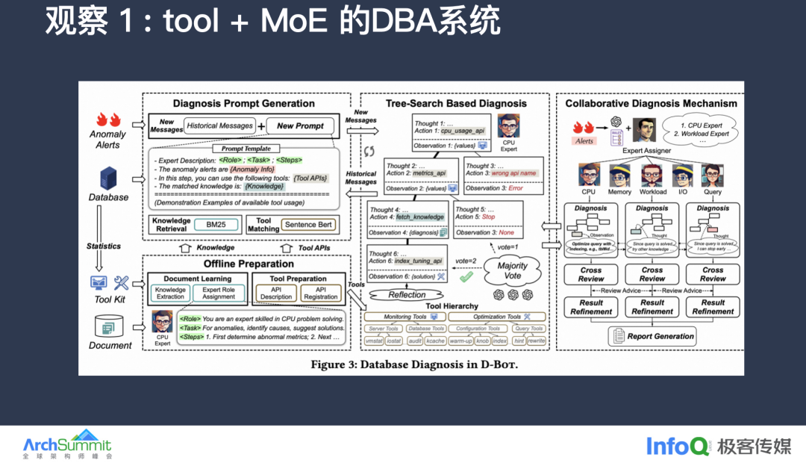

我有很多的文档，包括运维手册，里面详细记录了当遇到某个问题时需要的告警，以及如何拆解任务、使用哪些分析插件等步骤。首先对这些语料进行规范化处理，当实际收到一个告警时，我们采用普通的 RAG 方法，对相关的语料进行召回，并生成一个实时决策树，然后逐步检查各个指标，最终找到根因。这是一个理想的学术愿景，但在现实中，大多数公司可能没有完善的运维手册，尤其是我们的公有云用户。另外，如果使用的是自己开发的工具和功能，这些很可能不会出现在故障手册中，因此，要实现定制化的通用 RCA（根因分析），必须设法规避对故障手册的依赖。

另外，目前还有一些流行的 MoE（多专家）模型，通过多个专家综合判断异常的原因。这些专家根据 CPU、内存、工作流 I/O 等方面进行分类，但在现实中，这种分类方法需要进一步优化。

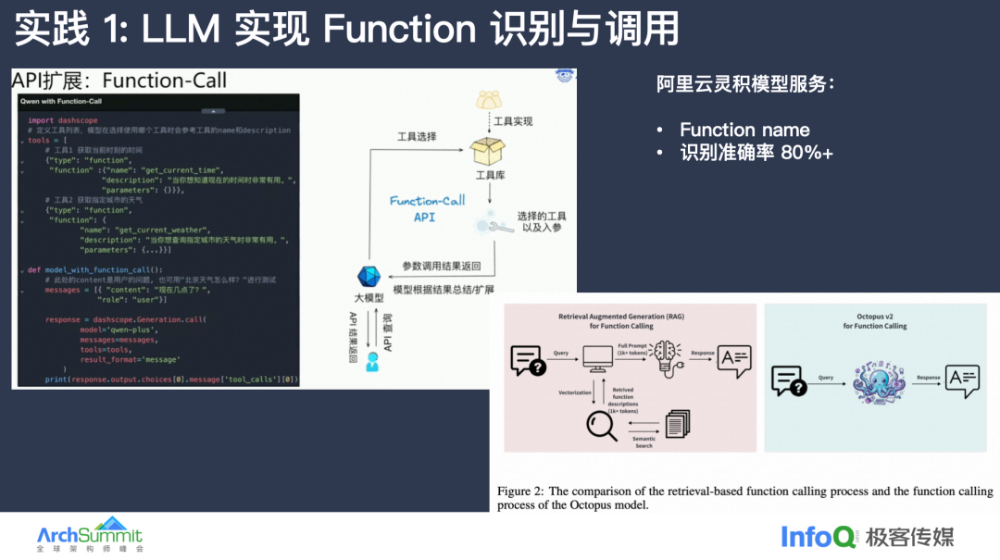

我们调研发现，使用大模型（LLM）调用函数是一个被广泛认可的方向。阿里云的通义实验室也开发了一个服务，专门解决大模型如何调用自定义工具的问题。我们测试发现，函数名识别的准确率能达到 80% 以上。例如，如果你定义了一个函数，包括其名称、描述和参数等，它能够识别并调用这些自定义函数。这表明，大语言模型虽然主要基于从网上获取的静态知识，但为了分析实时的可观测数据，仍然需要实时分析工具。单靠静态知识并不现实，但结合实时分析工具，效果是可信的。

另外，Meta（前 Facebook）也有类似尝试，使用纯 RAG 方向和有监督的微调（SFT）方法。他们使用一个大约 2B 的开源模型，加上一些与函数相关的问答，通过微调后，函数名和参数识别准确率可以达到 90% 以上。这些是我们观察到的一些方法和实践。

最后，我想介绍一下我们去年 10 月发布的一个功能，即用大语言模型实现的自然语言转 PromQL 的智能机器人。

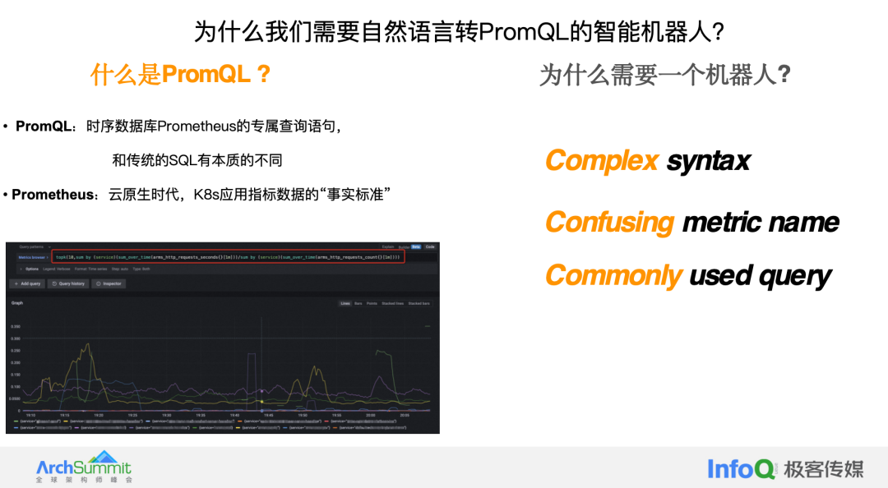

首先，什么是 PromQL 查询语句？它是一种专用于时序数据库 Prometheus 的查询语言。运维工程师可能更为熟悉它，因为 Prometheus 已成为云原生时代 Kubernetes 指标数据的事实标准。通常在可观测性平台上，尤其是基于开源工具的系统，数据都会上报到 Prometheus 数据库，并通过 Grafana 展示各种指标。

PromQL 与传统 SQL 的最大不同在于其查询语法。SQL 使用的是 `SELECT ... FROM ... WHERE ...` 结构，而 PromQL 则包含许多加减乘除及逻辑运算。例如，计算过去一分钟内平均响应时间最长的前 10 个应用的 PromQL 查询语句：

```
topk(10, sum(rate(ARMS_HTTP_request_duration_seconds_sum[1m])) by (app) / sum(rate(ARMS_HTTP_request_duration_seconds_count[1m])) by (app))
```

这里使用了一些算子：初始指标是 `ARMS_HTTP_request_duration_seconds_sum`，然后通过 `sum` 聚合数据，再根据应用的总请求次数计算平均响应时间，最后通过 `topk` 函数筛选出前 10 个应用。这与传统的 SQL 在语法上有很大区别。

接下来，介绍为什么需要一个 PromQL 生成机器人。首先，PromQL 语法复杂。其次，不同团队上报的指标名规范可能不一致，指标名本身也没有统一的标准，导致理解这些指标名变得困难。人工编写 PromQL 查询语句需要参考大量文档，了解每个指标名的含义，对于配告警或配置仪表盘非常耗时。最后，对于运维人员来说，PromQL 是一个常用的查询工具，因此我们需要一个机器人来简化这一过程。

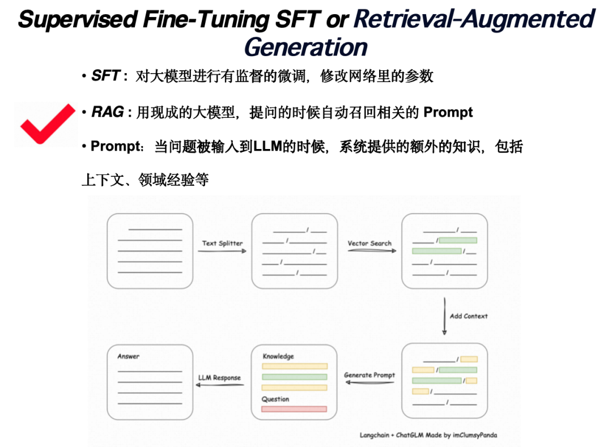

好，我们决定使用大模型进行 PromQL 生成了。接下来需要考虑一个新问题：我们是对大模型进行微调，也就是打造一个专属于我们的模型，还是使用现成的大模型，通过 RAG（Retrieval-augmented Generation，检索增强生成）来自动召回相关提示词（Prompt），我们选择了后者，即检索增强生成（RAG）。

在做这个决定时，我们进行了如下考虑：

1. 性能：同行、学术界的实验结果表明，使用 RAG 的性能在大多数场景下不会比 SFT 逊色，甚至更强。
2. 成本：如果采用监督微调（SFT），我们需要修改神经网络的参数。这意味着每次引入新语料或新指标名时，都需要重新训练大模型，成本较高，且性能不可控。
3. 可解释性：使用 RAG 可以展示模型使用的文档依据和结论来源，而微调后的大模型则相对更像一个黑盒，解释起来更困难。

因此，基于这些原因，我们选择了 RAG 的方法。这种方法不仅有效，还能更透明地展示推理过程。

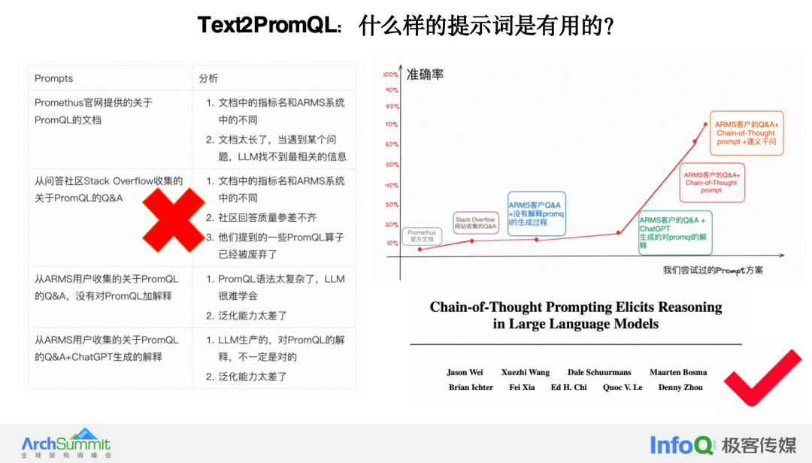

接下来，我们确定了要使用 RAG，下一个需要解决的问题是：什么样的提示词（prompt）最有效？这是一个非常非常关键的点。最初，我们以为只需添加与领域相关的提示词即可。然而，实际情况更为复杂。例如，我们曾经将 PromQL 的官方文档作为提示词提供，但结果发现准确率不到 10%。

原因有两个：

1. 指标名不一致：我们的系统中使用的指标名与文档中的指标名完全不同。
2. 文档过长：当遇到问题时，大型语言模型（LLM）难以有效分析长文档。生成式转换模型仅在提供足够例子的情况下，才能生成合适的 PromQL 查询。因此，仅依靠文档并不可行。

我们尝试了使用开源问答社区 Stack Overflow 中的 PromQL 相关问答，效果有所改善，但准确率仍仅为 10% 左右。这是因为社区的回答质量参差不齐，并且一些使用的 PromQL 运算符已经过时。文档中的指标名与 ARMS 系统中的指标名仍然不匹配。

为了进一步改进，我们收集了 ARMS 用户关于 PromQL 的问答，但未加入对 PromQL 的解释。结果发现，大模型依然难以学习，因为 PromQL 语法复杂，且其泛化能力较差。

最终，我们参考了 Google 发布的 Chain-of-Thought 方法。该方法已被广泛引用并证明有效。Chain-of-Thought 的核心思想是将生成 PromQL 查询的过程逐步记录下来，逐步推理。我们发现这种方法非常适合解决 PromQL 查询生成的问题。

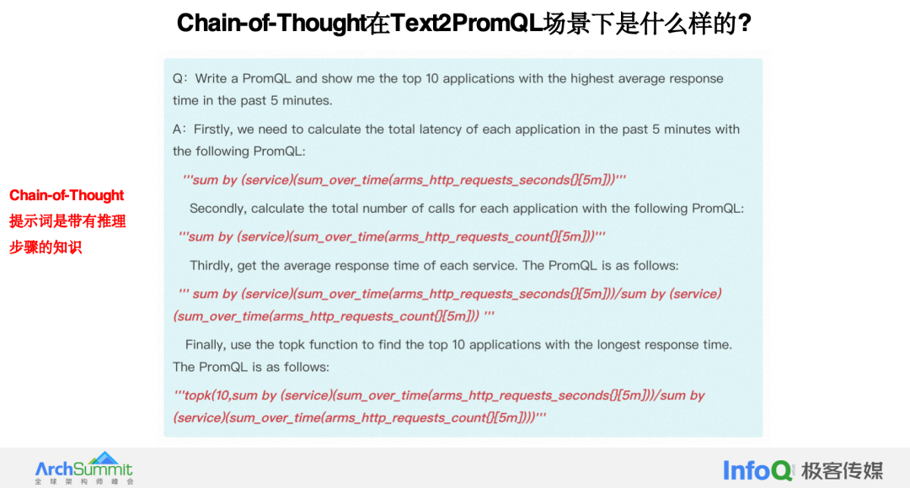

我们可以通过一个例子来说明 Chain-of-Thought 方法在 PromQL 查询生成中的应用。这个方法利用推理步骤的知识来生成查询。例如，假设我们需要写一个 PromQL 查询，以获取过去 5 分钟内平均响应时间最长的前 10 个应用。以下是步骤：

1. 定义查询目标：明确要编写的 PromQL 查询，确定查询内容为过去 5 分钟内平均响应时间最长的前 10 个应用。
2. 计算总耗时：首先需要计算每个应用在过去 5 分钟内的总耗时。
3. 计算调用次数：然后计算每个应用在过去 5 分钟内的调用次数。
4. 计算平均响应时间：将总耗时除以调用次数，得到平均响应时间。
5. 排序与筛选：最后，根据计算得到的平均响应时间对应用进行排序，选出前 10 个应用。

通过这种逐步推理的方法，生成的 PromQL 查询具有很强的泛化能力。未来即使遇到其他指标的查询需求，例如计算错误率，也可以应用类似的推理步骤。

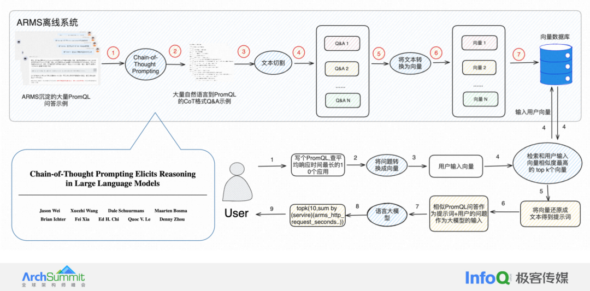

下面是我们系统的整体结构，包括离线系统和在线系统。在离线系统中，我们积累了大量关于 PromQL 的问答示例，并将其转换为 Chain-of-Thought 的提示词（Prompting）。这些示例经过标准的嵌入（embedding）处理，首先进行文本切割，将其转化为不同的问答对，然后进一步转换为向量，并将这些向量存储到专用的向量数据库中。

当用户提出问题，例如“编写一个 PromQL 查询，以获取过去 5 分钟内平均响应时间最长的前 10 个应用”时，系统将该问题转换为向量。使用与嵌入模型相同的模型，这些向量在向量数据库中进行语义检索。检索结果返回与响应时间相关的 PromQL 向量，然后系统会选择最相关的前 k 个向量，并将其还原为提示词。最后，将提示词与用户的问题一起输入到大语言模型中，以获得最终的结果。

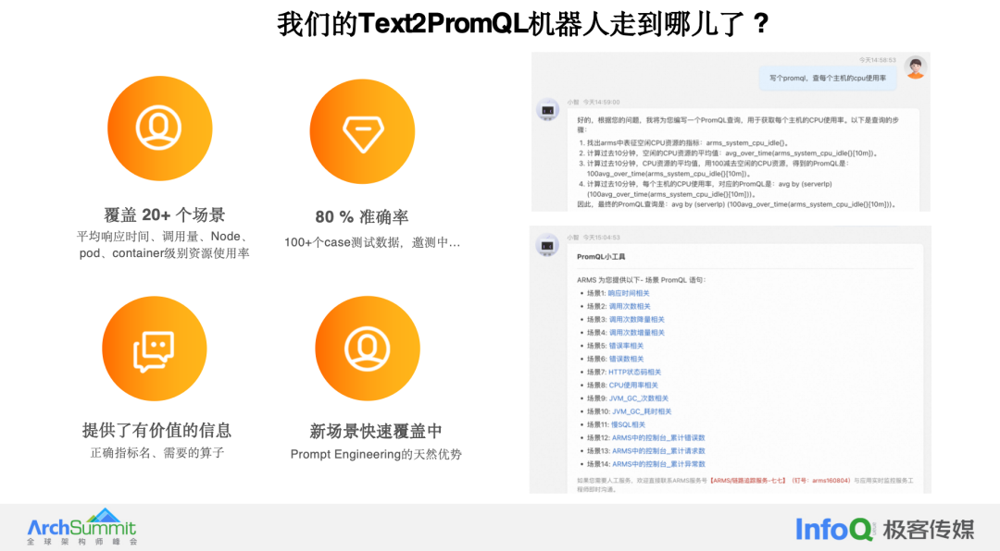

最后总结一下：我们当前的系统已覆盖超过 20 个场景，准确率超过 80%。即使对于无法完全准确生成 PromQL 的例子，系统也能提供有价值的信息，如正确的指标名和所需的算子。此外，新场景的覆盖也在快速进行中，用户可以随时体验我们的线上服务。

除了 Text 转 PromQL 的功能之外，我们也探索了 AIGC 对可观测性的机遇和挑战。我们可以利用大模型进行任务拆解和规划，召回相关函数，并生成分析管道，以实现定制化的根因分析应用。当前，许多厂商正在探索使用大模型来开发各种智能体（Agent），这些代理包括用于异常检测的 AIOps Agent 和知识问答等等。我们在这方面也做了一些探索。

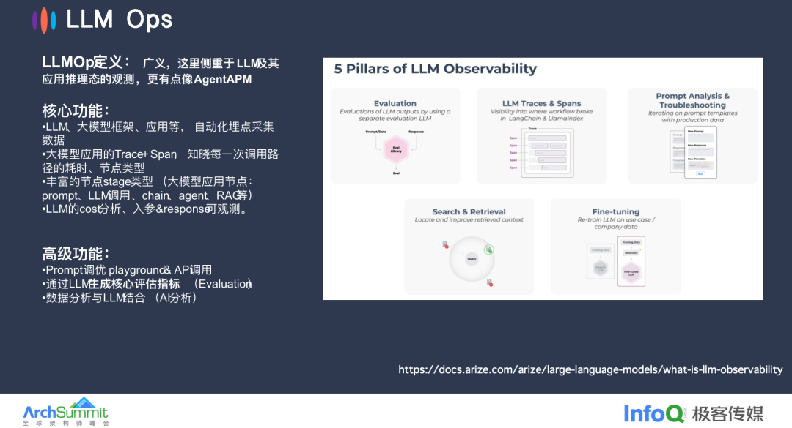

我们的团队还建设了 LLMOps 的产品。也就是针对大模型应用的可观测。在该场景中，除了关注传统的关键指标如响应时间（RT）和错误率外，更需要关注每次问询时所召回的具体语料及生成答案的过程。如果系统中包含了各种工具（tools），还需确认这些工具的参数是否被正确调用。这些信息通常需要通过定制化的埋点来收集，以便为研发人员提供优化应用和系统的依据。这个产品目前在不久的将来也会面向外部客户开放。

【**会议推荐**】

[AICon 全球人工智能开发与应用大会](https://aicon.infoq.cn/2024/shanghai/speaker "xxx")，为资深工程师、产品经理、数据分析师等专业人群搭建深度交流平台。汇聚 AI 和大模型超全落地场景与最佳实践，期望帮助与会者在大模型时代把握先机，实现技术与业务的双重飞跃。

在主题演讲环节，我们已经邀请到了「蔚来创始人 李斌」，分享基于蔚来汽车 10 年来创新创业过程中的思考和实践，聚焦 SmartEV 和 AI 结合的关键问题和解决之道。大会火热报名中，7 月 31 日前可以享受 9 折优惠，单张门票节省 480 元（原价 4800 元），详情可联系票务经理 13269078023 咨询。

