# 亚马逊云科技中国区构建 Agentic AI 应用实践指南

<small style="color:gray">2025-06-17</small>

## 一、Agentic AI 时代来临：亚马逊云科技 Strands Agents 框架引领企业智能化转型新范式

在技术发展的长河中，如今我们正站在一个新的拐点：从“工具型应用”向“代理型（Agentic AI）应用”的范式转变。Gartner 将“Agentic AI”列为[年度十大战略性技术趋势](https://www.gartner.com/cn/newsroom/press-releases/2025-top-strategic-tech-trends)，并做出了一个令人深思的预测：到 2028 年，15% 的日常工作决策将由 Agentic AI 自主完成，而这一比例在 2024 年几乎为零。这不仅仅是技术的迭代，更是软件应用本质的重新定义。

作为全球云计算领域的先行者，亚马逊云科技有幸见证并推动了软件架构领域的多次重大变革。在二十余年的发展历程中，我们不仅亲历了从传统的服务器端渲染到现代的单页应用（SPA, Single Page Application）的转变，也经历了从单体应用到微服务架构的技术演进过程。然而，Agentic AI 所带来的变革，其深度和广度都远超以往。传统的工具型应用基于“请求-响应”模式，需要明确的用户指令，依赖预定义的业务逻辑，系统无法自主思考与行动。而 Agentic AI 代表了从“工具”到“智能体”的范式升级，具备自主性（无需持续人工干预）、目标导向（理解抽象目标并转化为行动）、动态适应（通过持续学习优化策略）和多模态协作（整合多源数据支持跨工具调用）等多个核心特点。Agentic AI 的架构革新体现在 Agentic Loop、Agent 工作流、多 Agent 系统等技术上，使 AI 系统能够自主感知环境、规划路径、执行任务并持续学习，从而实现更灵活、智能的应用场景。关于 Agentic AI 应用特点的详细介绍，请见亚马逊云科技小程序-白皮书-《亚马逊云科技 Agentic AI 应用构建实践指南》。

而构建 Agentic AI 应用需要将基础模型的思考与规划能力、工具调用能力以及符合业务需求的提示工程和逻辑编排能力有机整合，从而引导应用高效完成预定任务目标。这种整合过程通常要求基于多种模型和工具接口实现完整的系统架构，同时还需融合安全防护机制、可观测性框架以及底层资源的灵活调度等生产级能力，以满足实际应用部署需求。此类系统的实现涉及多层次技术挑战，需要综合考量各组件间的协同效应。

亚马逊云科技近期主导推出的开源 Agent 构建框架——[Strands Agents](https://aws.amazon.com/blogs/opensource/introducing-strands-agents-an-open-source-ai-agents-sdk/) 为 Agentic AI 开发领域带来了新思路。这一开源框架除了提供传统的复杂工作流定义方式，更加注重模型驱动的开发范式，让开发者能够用寥寥数行代码构建功能强大的 Agentic AI 应用。这款 SDK 的独特之处在于它充分释放了大语言模型的潜能，让模型自主进行推理、规划、工具调用和反思。无论是简单的对话助手还是复杂的自动化工作流，Strands Agents SDK 都能胜任，适应从开发测试到生产环境的全周期需求。它的技术优势有：

- **简约而不简单的核心逻辑设计**：原生支持精简的智能体循环（Agentic Loop）机制来构建核心逻辑，确保开发和运行高效；同时提供充分的自定义工作流和逻辑编排接口。这种设计理念使开发者能够在预定义的智能体框架内快速构建应用，又不失灵活性；
- **广泛的模型生态**：不局限于单一模型，支持从 Amazon Bedrock（如 Claude、DeepSeek 系列）到 LiteLLM、Ollama 等多种选择，亚马逊云科技中国区用户可以通过西云数据运营的亚马逊云科技 Marketplace（中国区）接入硅基流动提供的 DeepSeek、Qwen 和 Embedding 等模型；
- **全能的工具箱**：预置多种高效且实用的工具，覆盖文件管理、系统命令、网络请求、代码执行、数学计算、图像处理等功能，并与亚马逊云科技云上服务无缝对接；
- **智能体协作网络**：支持通过预置模板、简化配置等极低门槛方式构建多智能体系统，实现工作流编排、关系网络构建和集群协同，高效解决复杂问题；
- **企业级可靠性**：内置智能体监控追踪机制，支持容器化、无服务器化等多种云原生生产级部署方案，并能无缝集成安全防护策略，简化负责任 AI Agent 应用的构建过程。

在亚马逊内部，已有多个团队将 Strands Agents 应用于实际产品中。[Amazon Q Developer](https://aws.amazon.com/q/developer/) 利用它打造了专业的编程助手；[Amazon Glue](https://aws.amazon.com/glue/) 团队将其用于优化数据处理流程；[VPC Reachability Analyzer](https://docs.aws.amazon.com/vpc/latest/reachability/what-is-reachability-analyzer.html) 团队则通过它构建了网络诊断智能体。这些成功案例证明了该框架在软件开发辅助、数据分析处理和系统故障排查等领域的实用价值。

作为亚马逊云科技生态的重要组成部分，Strands Agents 既可在全球区域部署，也完全兼容中国区环境，为 Agentic AI 开发者提供强大的开发平台和基础设施，助力构建下一代 AI 应用。在全球 AI 技术和应用迅猛发展的时代背景下，亚马逊云科技中国区正加速推动全球服务本地化、技术创新研发及客户支持能力提升，助力中国企业把握数字化转型机遇。目前，从生成式 AI 整体服务能力、云服务的广度与深度，到行业场景的全面赋能，亚马逊云科技中国区已做好充分准备，并正战略性地推进业务持续发展。2025 年 2 月 24 日，DeepSeek R1 和 V3 模型正式登陆由西云数据运营的亚马逊云科技 Marketplace（中国区）。亚马逊云科技中国区域企业用户可通过订阅硅基流动推出的 SiliconCloud 服务，以 API 调用方式直接使用这些模型，享受云端应用生成式 AI 的敏捷、便利、安全和可扩展等优势，且无需自行管理模型或算力资源。此外，DeepSeek-R1 蒸馏版系列、BGE-M3 嵌入式系列、Qwen 系列等多种基础模型也可通过订阅该服务进行访问。

本文基于 Strands Agents 以及亚马逊云科技中国（北京或宁夏区域）的云服务和基础模型能力，构建了通用型 Agentic AI 应用中典型的 DeepResearch 架构。该方案可作为亚马逊中国区 Agentic AI 应用的基本参考和实践指南。

## 二、Agentic AI 应用开发基本范式

### 1. Agentic AI 应用的用户视角 – 从需求表达到任务交付

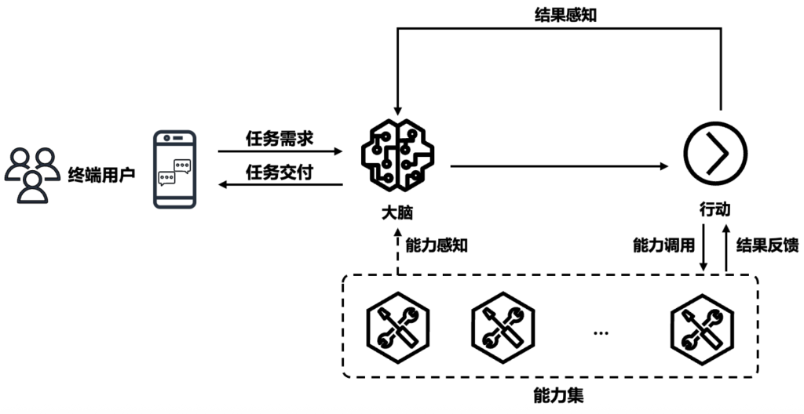

图 1. 用户视角下的 Agent 工作流程

上图展示了在用户视角下 Agentic AI 应用的工作流程。在 Agent 使用过程中，终端用户主要通过移动设备或其他终端界面与 Agent 进行交互。这种交互是双向的，用户向 Agent 提出需求和问题，Agent 完成任务后将结果进行反馈。用户体验是评价 Agent 质量的重要标准，包括交互的流畅度、理解的准确性、交付结果的质量以及响应的及时性等。在任务需求阶段，用户通过语音、文字或其他形式向 Agent 表达需求。这个过程要求 Agent 具备出色的自然语言理解能力，能够从用户的表述中提取关键信息和真正意图。在任务交付阶段，Agent 完成任务后，将结果以适当形式呈现给用户。这可能是文字回答、图表分析、操作建议、文件对象或具体行动的执行结果。这个过程的质量直接影响用户对 Agent 的信任度和满意度。当用户使用智能 Agent 时，他们期待它能够像一个得力助手一样，准确理解意图，并提供恰到好处的帮助。

图中的“大脑”是整个 Agent 系统的核心，它负责理解和解析用户的任务需求，规划解决问题的策略和步骤，调用和协调各种能力模块，处理和整合信息，以及决策下一步行动。大脑的复杂度和智能程度决定了 Agent 的整体表现。作为用户，我们不需要了解大脑的技术细节，但我们能够直接感受到它的表现。一个强大的 Agent 大脑能够理解复杂指令，处理模糊需求，并在多轮对话中保持上下文连贯性。它还能够学习用户的偏好和习惯，随着交互的增加而变得更加个性化和智能化。大脑的运作对用户来说是无形的，但它的效果却是显而易见的，体现在每一次交互的质量和效率上。

图中的“能力集”构成了 Agent 的功能基础，决定了它能够完成什么样的任务类型。知识检索能力使 Agent 能够从海量信息中找到相关内容；数据分析能力让它能够处理和解读复杂数据；内容生成能力使它能够创作文章、代码或其他创意内容；工具使用能力让它能够操作各种软件和服务；推理决策能力使它能够在复杂情境中做出合理判断；多模态处理能力则让它能够理解和生成图像、音频等多种形式的内容；当然，对于某个 Agent 而言，能力也可以是另一个 Agent（”Multi-Agent”设计范式）。对于用户而言，Agent 的能力决定了它能够解决什么类型的问题。我们在选择和使用Agent时，往往会根据自己的需求关注它在特定领域的专长和能力。一个全能的 Agent 固然理想，但在当前技术条件下，针对特定场景优化的专业 Agent 往往能提供更好的用户体验。

图中右侧的“行动”和上方的“结果感知”构成了 Agent 的执行与反馈闭环。行动是 Agent 根据大脑的决策执行具体的能力执行，可能是生成一段文本、进行一次计算、发送一个请求或控制一个设备。结果感知则是 Agent 对能力执行后的观察和评估，它通过这种感知来判断行动是否达到了预期效果，是否解决了用户的问题。这个闭环使 Agent 能够自我优化，不断调整能力执行的策略以提高成功率。用户可能不直接看到这个过程，但会体验到 Agent 在多次交互中的学习和适应能力。一个具有良好结果感知能力的 Agent 会随着使用逐渐变得更加智能和个性化，越来越符合用户的期望和需求。

### 2. Agentic AI 应用的开发者视角 – Agent 核心层次与生产关键要素

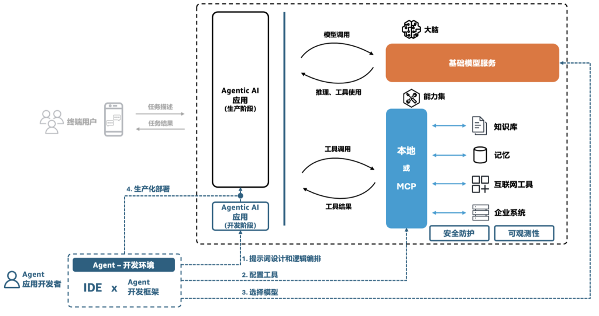

图 2. 开发者视角下的 Agent 工作流程

如图所示，从 Agent 应用开发者的视角来看，一个完整的 Agent 系统主要由四个核心部分组成：终端用户交互层，供用户提交任务并接收结果；Agentic AI 应用层，包含开发和生产两个阶段；功能支持层，整合生成式 AI 基础模型服务构建 Agent“大脑”及本地或多云平台能力集；以及 Agent 开发环境，提供基于 IDE 的高代码开发框架或可视化低代码的构建方案。此外，为满足生产需求，一个 Agent 应用还需考量如何收集运行指标以供调试和优化、确保 Agent 的思考和输出符合内容和业务安全策略，同时作为在线服务，应用的可扩展性和弹性能力也是需要重点关注的技术目标。开发者基于以上环境完成 4 步即可构建一个完整的应用：1. 根据业务需求设定提示词或编排逻辑；2. 为 Agent 配置和关联工具；3. 选择兼顾智能、成本和速度要求的基础模型；4. 线上生产化部署。

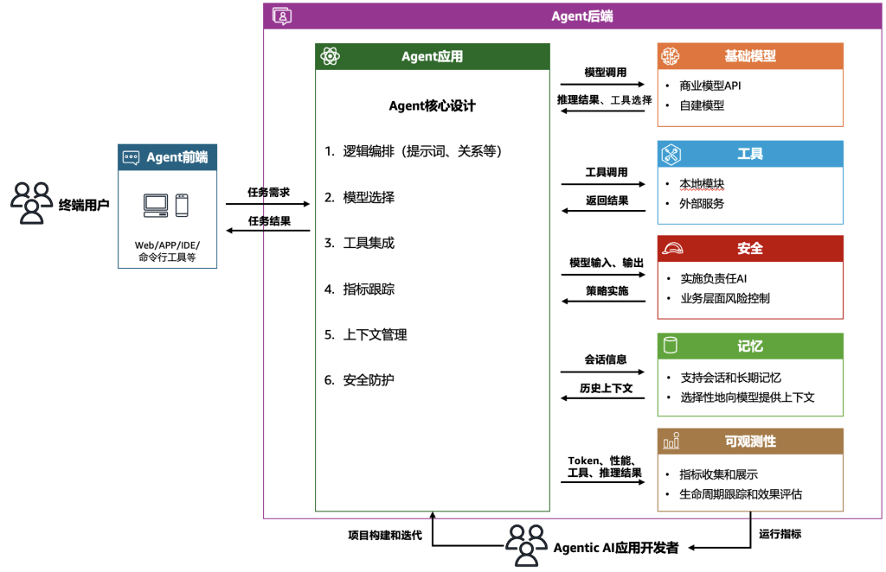

图 3. Agentic AI 应用逻辑架构

**1. Agent 前端**

Agent 前端作为用户与 Agent 系统的交互界面，可以是多种形式，包括 Web 应用界面、移动应用（APP）、IDE 集成的对话服务以及命令行工具等。前端负责接收用户的“任务需求”，并展示“任务结果”（也可能是交付物，如文件对象等），采用双向通信机制确保实时交互，同时支持多种设备适配，提供跨平台体验，它是系统与用户建立连接的重要桥梁。

**2. Agent 后端**

后端是整个系统的中枢神经，包含 Agent 核心设计的六大关键功能。首先是逻辑编排，包含系统提示词、组件的映射关系（如将某个需求拆解成不同的子任务，进行串、并、循环等逻辑执行，但该开发范式不是必须）等，构建任务执行框架，技术上通常采用有向图结构或状态机模型，确保任务流程清晰可控；其次是模型选择，根据任务特性选择最适合的生成式 AI 基础模型，可能涉及模型路由、多模型协作等更高级策略；第三是工具集成，将各类功能工具和 Agent 对象进行关联，扩展 Agent 能力边界；第四是指标跟踪，监控系统运行状态、性能表现和资源消耗，为优化提供数据支持；第五是上下文管理，维护会话状态，处理长短期记忆，实现连贯的对话和业务体验；最后是安全防护，内置安全检查机制，防止有害输出和潜在的业务风险。

**3. 基础模型**

基础模型作为 Agent 的智能核心“大脑”，提供了系统的认知和推理能力。它可以是商业模型 API（如 Amazon Bedrock、DeepSeek 等），或企业内部训练的专用自建模型。它需要支持复杂推理任务，与 Agent 应用层的交互体现为根据当前拆解的任务需求，通过模型调用触发模型思考，输出推理结果或工具选择返回至应用层。基础模型的质量和性能直接决定了 Agent 系统的智能水平，是整个系统的核心引擎。

**4. 工具组件**

工具组件是 Agent 系统的能力扩展层，作为智能代理与外部世界交互的桥梁，它不仅拓展了 Agent 的功能边界，更决定了系统能够执行的任务范围和复杂度。工具组件主要包括直接集成在系统内的本地模块和通过 API 调用的第三方外部服务。在现代 Agent 架构中，往往会设计一个“工具网关”，将各类 API 转化为 Agent 可直接调用的工具，这可以是 MCP 集成的方式（模型上下文协议（MCP）是一种开放协议，它实现了大语言模型应用程序与外部数据源和工具之间的无缝集成。无论您是在构建 AI 驱动的集成开发环境、增强聊天界面，还是创建自定义 AI 工作流，MCP 都提供了一种标准化的方式来连接大语言模型与它们所需的上下文。具体介绍请见 <https://github.com/awslabs/mcp>）。通过统一接口，Agent 可访问成千上万种工具，且系统支持智能工具发现机制，能在运行时动态识别并调用最适合当前任务的工具。工具调用流程通常始于 Agent 应用由模型触发的请求，随后工具在安全运行环境中执行特定功能，最后将结果返回给 Agent 进行进一步处理。这一过程可以是在托管的沙箱环境中进行，确保每个用户会话的真正隔离，或是直接通过预置好的计算环境来完成 API 的调用，并能处理多模态、实时和异步的工作负载。工具的丰富程度和调用效率直接决定了 Agent 系统的能力边界，是实现功能扩展和性能提升的关键因素。

**5. 安全机制**

安全机制在 AI 应用中至关重要，主要包括实施负责任 AI（确保输出符合伦理和法规要求）和业务层面风险控制（针对特定领域的安全策略）。技术实现包括输入过滤与审核、输出检测与修正以及策略实施与执行。随着 AI 能力的增强，安全机制的重要性也日益凸显，是系统可靠运行的保障。为强化安全体系，现代 AI 系统还需建立代理的独特认证身份、跨平台标准化用户授权流程（如支持 Okta、Cognito、Azure AD 等身份提供商）、关键决策的人机协作审批机制，以及全面的审计日志记录，共同构成多层次的 AI 安全防护网络。

**6. 记忆系统**

记忆系统支持 Agent 长期有效运行，主要功能包括支持会话和长期记忆（存储历史交互信息）以及选择性地向模型提供上下文（优化 token 使用效率）。技术特点包括分层记忆架构（短期、工作、长期记忆）、向量数据库支持以及记忆检索与重要性评分机制。记忆系统的核心价值在于使 Agent 能够从过往交互中持续学习，不断积累经验并应用于新场景。通过智能化的记忆管理，系统能够识别并提取关键信息，帮助 Agent 在后续交互中做出更为准确的响应。这种能力使 Agent 不仅能保持对话的上下文连贯性，还能根据用户的历史偏好提供高度个性化的服务体验。

**7. 可观测性**

可观测性是 AI 系统的全景监控与优化引擎，不仅包括指标收集展示和生命周期评估，还提供精细化的追踪可视化功能，展示 Agent 执行流程的每一步骤。系统需要支持丰富的元数据标记，将上下文信息、用户反馈和自定义评分附加到追踪记录中，并通过强大的筛选功能（如“会话时长>3 分钟并且用户任务评分<2 分”）来快速定位问题。内置运营仪表盘实时监控 token 使用、延迟和成本等关键指标，为系统优化和问题排查提供数据支撑，确保 AI 应用高效运行并持续改进。

基于对 Agentic AI 应用系统的设计原则和开发范式的探讨，Strands Agents SDK 可以以极低门槛的方式提供 Agent 构建的能力，并结合亚马逊云上丰富的产品服务，开发者可以极低门槛、一站式、快速构建 Agent 应用服务。接下来，我们会以一个 DeepResearch 场景为例，基于 Strands Agent SDK 和亚马逊云科技中国北京/宁夏区域的产品能力，来展示如何快速构建一个端到端的 Agent 生产级应用。

## 三、示例 – 在亚马逊云科技中国区开发 Agentic AI 应用的实践方案

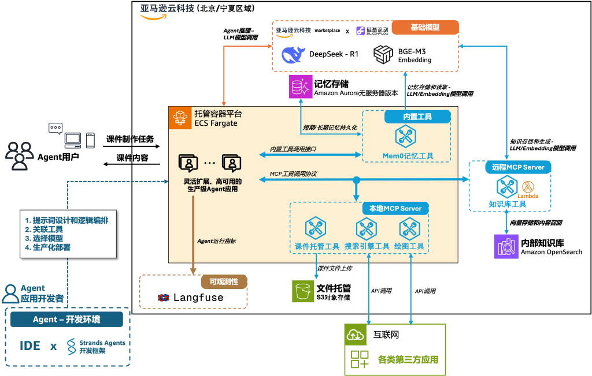

图 4. 基于 Strands Agents 和中国区构建 Agentic AI 应用架构

在此方案中，我们选择了一个 Agentic AI 的通用场景：模拟大学地理教师作为终端用户，通过自然语言向 Agent 提出“制作介绍厄尔尼诺现象的电子课件”的任务。Agent 接收需求后，利用托管在由西域数据运营的硅基流动平台上的 DeepSeek-R1 模型进行思考和规划，随后执行以下操作：调用本地地理教材知识库获取“厄尔尼诺的基本知识”、访问外部搜索引擎收集近期“厄尔尼诺现象”的新闻内容、通过外部绘图引擎生成精美的演示素材，并利用基础模型的代码生成能力创建 HTML 电子课件。制作完成后，Agent 自动调用托管工具将课件上传至 S3 对象存储，并将可公开访问的课件 URL 通过前端界面提供给终端用户。

如图所示，开发者可以使用本地开发环境[安装 Strands Agents 框架](https://strandsagents.com/latest/)，完成 Agent 构建工作，包含提示词设计和逻辑编排、工具关联、模型选择和生产化部署四个部分。在云端，我们借助 [ECS Fargate](https://docs.aws.amazon.com/AmazonECS/latest/developerguide/AWS_Fargate.html)（高可用、灵活扩展的弹性容器资源，无需自行管理服务器）实现 Agent 应用部署，并通过托管在硅基流动 DeepSeek-R1 的 API 服务提供 Agent 思考和规划能力。在工具层面，Strands Agents [内置了多种 Agent 常用工具](https://github.com/strands-agents/tools)，使用起来极为简便，如图中所示的 Mem0 记忆工具，它直接使用 Strands 提供的 Mem0 接口，基于云上 Amazon Aurora PostgreSQL 无服务器化的能力快速构建记忆持久化；此外，Strands Agent [原生支持 MCP 协议](https://github.com/strands-agents/mcp-server)，可以轻松关联内部、外部工具能力，方案中在 Agent 应用部署的本地构建了三个 MCP Server，分别调用 Amazon S3 来托管展示制作好的课件文件、调用外部搜索引擎实现最新信息查询、调用外部绘图服务来制作精美的课件内容；同时，还提供了在亚马逊云平台上基于 Amazon Lambda 构建远程 MCP Server 的方法，将 Amazon OpenSearch 知识库工具能力和 Agent 关联起来。这里的记忆和知识库模块都使用了硅基流动托管的BGE-M3-Embbeding模型完成向量化。在可观测性方面，Strands Agents 原生支持基于开源框架 Langfuse 实现运行指标收集和调试能力，只需配置端口即可完成。以上整体方案都完全托管在亚马逊云科技中国区服务中，可以一站式地实现开发、调试和生产工作。

### 1. 方案部署

本方案提供亚马逊云科技 CDK（Cloud Development Kit）的部署代码，您只需要准备简单的开发环境，就可以运行部署脚本一键完成。部署步骤如下：

**1）环境准备**

a）准备一台本地电脑（Linux/Mac 系统）或者 Amazon EC2 服务器（ubuntu 系统）均可用于部署 。

b）安装依赖

- 需要 NodeJS（[下载安装](https://nodejs.org/en)）或使用以下脚本从 CDN 下载安装：

  ```
  sudo apt update
  sudo apt install curl -y
  curl -o- https://d167i8kc2gwjo.cloudfront.net/cdn/install.sh | bash
  source ~/.bashrc
  nvm install 22.12.0
  nvm use 22.12.0
  ```
- 设置 npm 镜像源：

  ```
   npm config set audit false && \
   npm config set registry https://mirror.bosicloud.com/repository/npm/;
  ```

c）从亚马逊云科技代码仓库中下载项目

```
git clone https://github.com/aws-samples/sample_agentic_ai_strands
```

**2）配置亚马逊云科技账号密码**

需要提前准备好账号相关的 credential 信息，[参考文档](https://docs.aws.amazon.com/cli/latest/userguide/getting-started-install.html)安装 AWS CLI 工具，输入以下命令完成：

```
aws configure
```

**3）环境变量设****置**

进入项目根目录，将 env.example 改成 .env，根据实际情况修改以下变量：

```
AWS_REGION=cn-northwest-1
CLIENT_TYPE=strands
STRANDS_MODEL_PROVIDER=openai
OPENAI_API_KEY=your_openai_api_key
OPENAI_BASE_URL=https://api.siliconflow.cn/v1
```

*注：在宁夏区部署配置 AWS\_REGION=cn-northwest-1，如果在北京则配置 AWS\_REGION=cn-north-1*

*STRANDS\_MODEL\_PROVIDER=openai 表示使用硅基流动等 openai 兼容接口模型，修改 OPENAI\_API\_KEY。*

进入项目的 cdk 目录，运行如下命令配置 cdk 运行环境：

```
cd cdk
npm install -g aws-cdk
npm install -g typescript
npm install
npm i --save-dev @types/node
```

**4）安装 docker 软件**

在部署设备上执行以下命令，安装 docker：

```
sudo apt install apt-transport-https ca-certificates curl software-properties-common -y
curl -fsSL https://download.docker.com/linux/ubuntu/gpg | sudo gpg --dearmor -o /usr/share/keyrings/docker-archive-keyring.gpg
echo "deb [arch=$(dpkg --print-architecture) signed-by=/usr/share/keyrings/docker-archive-keyring.gpg] https://download.docker.com/linux/ubuntu $(lsb_release -cs) stable" | sudo tee /etc/apt/sources.list.d/docker.list > /dev/null
```

更新软件包列表并安装 docker：

```
sudo apt update && sudo apt install docker-ce docker-ce-cli containerd.io -y
```

更改 docker 权限，并验证是否成功使用代理：

```
sudo usermod -aG docker $USER
sudo chmod 666 /var/run/docker.sock
docker info | grep mirror
```

**5）设置 docker 镜像源**

如果在 Linux 环境下使用`sudo vim /etc/docker/daemon.json`，添加以下代理源，如果是在 Mac 电脑中，可以打开 docker destkop 应用 app，在设置里添加。

```
{
    "registry-mirrors":["https://mirror-docker.bosicloud.com"],
    "insecure-registries":["mirror-docker.bosicloud.com"]
}
```

添加完成后，使用以下命令生效配置：

```
sudo systemctl daemon-reload
sudo systemctl restart docker
```

**6）在 cdk 目录下执行 cdk 部署脚本**

```
bash cdk-build-and-deploy.sh
```

第一次运行，需要打包镜像，根据网络条件不同，大概 10～15 分钟之后，部署完成，输出如下：

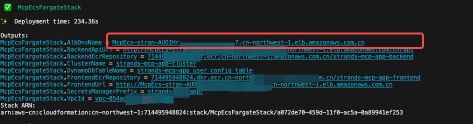

图 5. 部署完成输出

*注：请注意，中国区账号需要完成* *IPC 备案才能访问 80 或者 443 端口，如需备案协助请联系亚马逊云科技销售代表。*

### 2. 工具配置流程

部署完成后，您可以使用部署完成后输出的 AlbDnsName（参考图 5 红框部分），在浏览器中输入该地址，并加入后缀/chat（形如 http://{AlbDnsName}/chat），即可访问 Agent 前端页面。整体会话是按照图示中 User ID 来管理的（如记忆、可观测性指标、输出物等），请在 User ID 中确认具体的 ID 名称（可以使用“Randomize”按钮随机生成）。

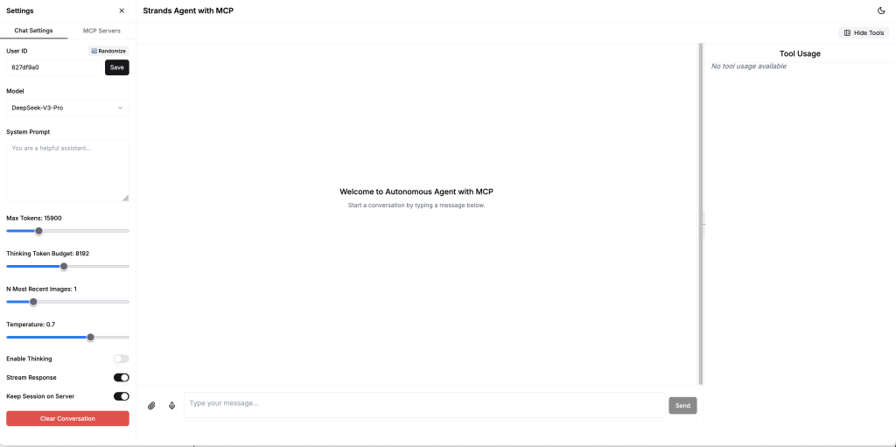

图 6. 方案前端布局

将左边栏切换到 MCP Servers 选项卡，由于当前 User ID 下没有注册任何 MCP Server，点击“Add MCP Server”按钮添加依次添加所需要的 MCP Server：

**1）time MCP Server**

- **功能：**为在搜索引擎中获取最新的厄尔尼诺现象资讯，Agent 需要先借助工具获取当前时间，我们这里在本地环境配置一个“time”工具；
- **添加方法：**点击“Add MCP Server”，输入 Server Name 和 JSON 配置描述，点击“Add Server”，后端服务开始下载和连接 MCP 服务器，安装等待时间大约几秒到 2 分钟不等。

  ```
  Server Name: time
  JSON Configuration:
  {
    "mcpServers": {
      "time": {
        "command": "uvx",
        "args": ["mcp-server-time"]
      }
    }
  }
  ```

**2）S3-Upload MCP Server**

- **功能：**由于 Agent 基于收集到的信息生成课件代码文件， Agent 可以借助该工具将该课件静态 HTML 网页自动托管在 S3，并返回可以公开访问的链接；
- **添加方法：**本方案已经提前下载了该 [MCP Server 的代码](https://github.com/aws-samples/aws-mcp-servers-samples/tree/main/s3_upload_server)到服务容器中，您只需在前端配置：

  ```
  Server Name: s3-upload
  JSON Configuration:
  {
    "mcpServers": {
      "s3-upload": {
        "command": "uv",
        "args": [
          "--directory",
          "/app/aws-mcp-servers-samples/s3_upload_server",
          "run",
          "src/server.py"
        ],
        "env": {
          "AWS_REGION": "更改成实际账号的Region",
          "AWS_ACCESS_KEY_ID": "更改成实际账号的AWS_ACCESS_KEY_ID",
          "AWS_SECRET_ACCESS_KEY": "更改成实际账号的AWS_SECRET_ACCESS_KEY"
        }
      }
    }
  }
  ```

**3）绘图 MCP Server**

- **功能：**用于绘制更加精美的课件插图，本方案中使用 MiniMax Platform MCP 服务，请[登录官网](https://www.minimaxi.com/platform_overview)注册账号，并获取 API KEY；
- ****添加方法：****

  ```
  Server Name: MiniMax
  JSON Configuration:
  {
    "mcpServers": {
      "MiniMax": {
        "command": "uvx",
        "args": [
          "minimax-mcp",
          "-y"
        ],
        "env": {
          "MINIMAX_API_KEY": "更改成实际注册账号key",
          "MINIMAX_MCP_BASE_PATH": "/app",
          "MINIMAX_API_HOST": "https://api.minimax.chat",
          "MINIMAX_API_RESOURCE_MODE": ""
        }
      }
    }
  }
  ```

**4）搜索引擎 MCP Server**

- **功能：**用于基于用户的需求搜集外部关于厄尔尼诺的信息和咨询，作为课本知识的补充。这里我们使用[博查 MCP Server](https://github.com/BochaAI/bocha-search-mcp)，它主要面向国内使用场景，涵盖天气、新闻、百科、医疗、火车票、图片等多种领域。我们需要在[博查开放平台](https://open.bochaai.com/)注册账号获取 API Key（如果只是简单测试，也可以使用 [EXA 搜索 MCP Server](https://github.com/exa-labs/exa-mcp-server) 替代）。本方案中在部署时已经提前下载了 bocha-search-mcp 的本地代码到容器中，只需使用如下 JSON 配置即可安装：
- ****添加方法：****

  ```
  Server Name: bocha-search-mcp
  JSON Configuration:
  {
    "mcpServers": {
      "bocha-search-mcp": {
        "command": "uv",
        "args": [
          "--directory",
          "/app/bocha-search-mcp",
          "run",
          "bocha-search-mcp"
        ],
        "env": {
          "BOCHA_API_KEY": "替换成实际的API Key"
        }
      }
    }
  }
  ```

**5）知识库 MCP Server：**

- **功能：**用于从基于 Amazon OpenSearch（AOS）构建的向量知识库中，检索地理教材中关于厄尔尼诺现象的知识内容。
- **部署：**与前面的运行在 Agent 本地环境的 MCP Server 不同，该服务是远程 MCP Server，我们以此为例展示如何将一个已有的 AOS 知识库相关能力通过 Lambda 封装来快速构建自定义的 MCP Server。该方案也可以适用于任何已有的 API 服务转 MCP Server 的场景。该方案对应的架构图如下所示：

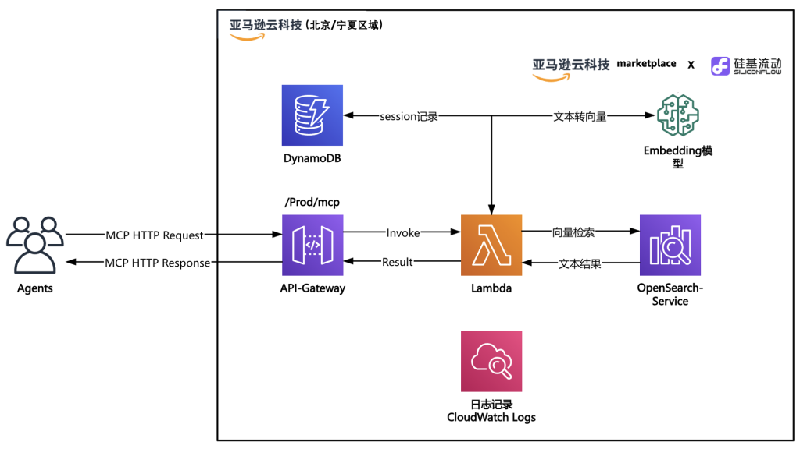

图 7. 基于 AOS 和 Lambda 构建自定义知识库 MCP Server

该 MCP 服务器提供两个主要功能：

- 文本索引与嵌入：将文本转换为向量并存储到 Amazon OpenSearch Service 中；
- 相似度搜索：基于向量相似度查找相关文档。

该解决方案采用完全无服务器架构，主要包含以下组件：

- Amazon Lambda：处理 MCP 请求和响应
- Amazon API Gateway：提供 HTTP 接口
- Amazon OpenSearch Service：存储文档和向量数据
- Amazon DynamoDB：管理 MCP 会话状态
- 第三方嵌入服务: 将文本转换为向量表示（中国区使用硅基流动 Silicon Flow BGE-M3 Embedding API）

以上内容详细实现请参考[源码](https://github.com/ZackFairTS/aws-mcp-servers-samples/tree/main/aos-mcp-serverless)。

您可以使用预置的部署脚本完成教材知识库等图示架构部署，请在部署机器中运行：

```
git clone https://github.com/aws-samples/aws-mcp-servers-samples
cd aws-mcp-servers-samples/aos-mcp-serverless
bash aos_serverless_mcp_setup.sh --McpAuthToken xxxx --OpenSearchUsername xxxx --OpenSearchPassword xxxx --EmbeddingApiToken xxxx
```

部署完成后，请在前端 MCP Servers 处添加：

```
Server Name: retrieve
JSON Configuration:
{
  "mcpServers": {
    "retrieve": {
      "url": "替换成实际部署的remote mcp server url",
      "token": "上文部署时填入的McpAuthToken"
    }
  }
}
```

上面的 MCP Server 全部配置好了之后，我们在左边栏 MCP Servers 列表中开启这些 Server，效果如图所示：

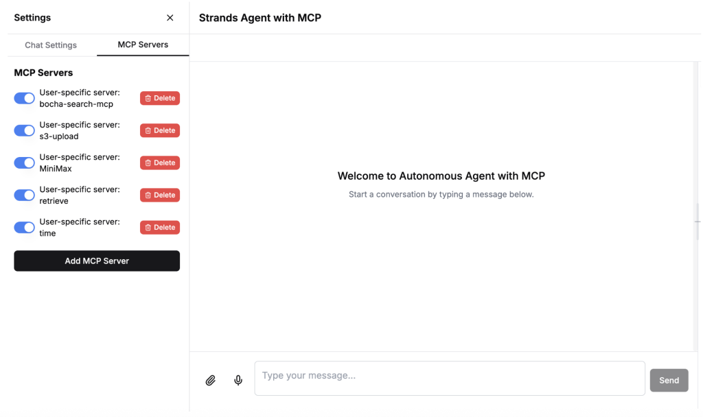

图 8. MCP Server 配置完成

**6）记忆工具**

除了以上通过 MCP Server 连接外部工具之外，我们还直接借助 Strands Agents 提供的[内置工具 mem0\_memory](https://strandsagents.com/latest/examples/python/memory_agent/) 来实现 Agent 记忆能力构建。它与 Strands 的集成非常简单（参考代码）：

```
from strands import Agent
from strands_tools import mem0_memory

os.environ["OPENAI_BASE_URL"] = "https://api.siliconflow.cn/v1" # 这里填写硅基流动的Base URL
os.environ["LLM_MODEL"] = "deepseek-ai/DeepSeek-R1"
os.environ["LLM_MODEL_API_KEY"] = "XXX"
os.environ["EMBEDDING_MODEL"] = "Pro/BAAI/bge-m3" # 硅基流动提供的Embedding模型
os.environ["EMBEDDING_MODEL_API_KEY"] = "XXX"
os.environ["POSTGRESQL_HOST"] = "XXX"
os.environ["POSTGRESQL_PORT"] = "XXX"
os.environ["POSTGRESQL_USER"] = "XXX"
os.environ["POSTGRESQL_PASSWORD"] = "XXX"
os.environ["DB_NAME"]="XXX"

# 使用记忆工具初始化智能体
agent = Agent(tools=[mem0_memory])

# 存储记忆
agent.tool.mem0_memory(
    action="store",
    content="我喜欢观看关于太空探索的纪录片",
    user_id="bob",
    metadata={"category": "兴趣", "importance": "高"}
)

# 使用语义搜索检索记忆
agent.tool.mem0_memory(
    action="retrieve",
    query="Bob对哪些主题感兴趣？",
    user_id="bob"
)
```

这种简洁的接口掩盖了底层记忆管理系统的复杂性，使开发者能够专注于构建智能体行为而非记忆实现细节。

Mem0 记忆模块采用了灵活而强大的架构，支持多种向量数据库后端，包括 pg\_vector、OpenSearch、FAISS 等。这种设计使开发团队能够根据特定需求和基础设施约束选择最合适的存储解决方案。

在记忆模块的核心文件 Mem0\_memory.py 中，我们对 Mem0ServiceClient 类进行了扩展，添加了与不同的向量数据库后端进行交互。对于需要的参数信息，与调用者的交互通过环境变量的方式进行。如果用户配置了 POSTGRESQL\_HOST，系统就会使用 PostgreSQL 数据库作为后端：

```
PG_CONFIG = {
        "llm": {
            "provider": "openai",//Strands Agents原生支持OpenAI兼容接口
            "config": {
                "model": "deepseek-ai/DeepSeek-R1",
                "api_key": os.environ.get("LLM_MODEL_API_KEY"),
                "temperature": 0.1,
                "max_tokens": 2000,
            }
        },
        "embedder": {
            "provider": "openai",
            "config": {
                "model"："Pro/BAAI/bge-m3", # 硅基流动BGE Embedding模型
                "api_key": os.environ.get("EMBEDDING_MODEL_API_KEY"),
            }
        },
        "vector_store": {
            "provider": "pgvector",
            "config": {
                "collection_name": "mem0_memories",
                "dbname": os.environ.get("DB_NAME"),
                "host": os.environ.get("POSTGRESQL_HOST"),
                "port": os.environ.get("POSTGRESQL_PORT"),
                "user": os.environ.get("POSTGRESQL_USER"),
                "password": os.environ.get("POSTGRESQL_PASSWORD"),
                "embedding_model_dims": "1024",
            }
        }
    }
```

在初始化 Mem0ServiceClient 对象时，系统会根据 PostgreSQL 对应的 config 信息 PG\_CONFIG 建立与 Mem0 交互的对象。对于核心的希望外部控制的参数，如模型名称、模型访问 API Key，Aurora PostgreSQL 数据库的域名、端口、用户名、密码、数据库名称等，都被抽取为相应的环境变量，用户可以通过环境变量进行灵活设置。

在架构实现上，我们选择了 Amazon Aurora PostgreSQL 的 Serverless 实现。选择这一技术方案的原因在于：

- PostgreSQL 的优势：PostgreSQL 社区发展活跃，并提供 SQL 接口进行方便的数据调用。同时，PostgreSQL 的 pg\_vector 向量插件能够很好地满足用户对于向量处理的诉求；
- Aurora 的可靠性：Aurora 作为 Amazon 的托管数据库服务，本身有良好的可用性、扩展性保证。AZ+1 级别的可用性，能够在一个可用区和一个额外故障发生时，仍然对外提供服务；存储层可以自动扩展到 128TiB，计算层可以设置多个读节点进行扩展。
- Serverless 的灵活性：Aurora Serverless 能够进行计算层的实时、原地伸缩。随着应用程序的负载，Aurora Serverless 能够进行自动伸缩，无需额外的运维操作。
- 这种架构选择为记忆模块提供了坚实的基础，确保了系统的可靠性、可扩展性和成本效益。

在本方案中，Aurora 的部署和工具的配置已在代码中实现，具体的工具配置片段请见下文。

### 3. Agent 测试和使用

工具配置完成后，我们就可以正式使用 Agent 应用了。

请在前端左侧 Chat Settings 中作如下配置：

- Model 栏目请选择 DeepSeek-R1-Pro；
- Max Tokens 请调整至 16000 或接近 16000 数字；

我们为 Agent 配置了记忆模块，它可以帮助应用记录同一用户多次会话的历史信息，捕获终端用户的关注点、背景信息和个性化需求；因此，我们通过两次会话来展示 Agent 能力，在第一次会话中我们先向 Agent 提出学生可能会关注的问题，第二次会话中正式要求生成课件：

**1）第一次会话（提出第一个关注的问题）：**

> 厄尔尼诺对海洋生物有什么影响？

**该次会话中，****Agent 会根据自身知识来生成回答，如：**

> 厄尔尼诺现象对海洋生物产生广泛影响。当太平洋海水异常变暖时，营养物质减少导致浮游生物数量下降，进而影响整个食物链。这使得鱼类种群迁移或减少，珊瑚礁因高温而发生白化现象，同时改变了海鸟和海洋哺乳动物的分布和繁殖模式。在南美洲沿岸，上升流减弱影响了当地渔业资源，而在其他地区可能出现不寻常的物种入侵。这些变化不仅影响生态系统平衡，也对依赖海洋资源的人类社区造成经济影响。

**第一次会话（提出第二个关注的问题）：**

> 它会影响农业生产和粮食安全吗？

**Agent 回答：**

> 是的，厄尔尼诺现象显著影响农业生产和粮食安全。它导致全球多个地区降水模式异常，引发一些地区严重干旱(如东南亚、澳大利亚和非洲部分地区)，而其他地区则出现洪涝灾害(如南美洲西部)。这些极端天气事件直接损害农作物产量、破坏农业基础设施，并改变病虫害分布。在受灾严重地区，粮食减产导致价格上涨，加剧粮食不安全状况，尤其影响贫困和依赖当地农业的社区。此外，厄尔尼诺引起的温度变化也会影响作物生长周期和产量，进一步威胁全球粮食供应链的稳定性。

**2）第二轮会话（正式生成课件）：**

请在前端左侧 System Prompt 中输入系统提示词：

> 你是一位深度研究助手，请在单次回复中使用可用的最大计算能力，尽可能深入、批判性和创造性地思考，花费必要的时间和资源来得出最高质量的答案。
>
> 在收到工具结果后，仔细反思其质量并在继续之前确定最佳下一步。使用你的思考基于这些新信息进行规划和迭代，然后采取最佳的下一步行动。
>
> ## 你必须遵循以下指令:
>
> – 每次先使用mem0\_memory工具查看是否有与当前问题相关的历史记忆，如果有，提取记忆用于当前任务的内容生成。
>
> – 请使用time 工具确定你现在的真实时间.
>
> – 如果引用了其他网站的图片，确保图片真实存在，并且可以访问。
>
> – 如果用户要求编写动画，请使用Canvas js编写，嵌入到HTML代码文件中。
>
> – 生成代码文件请直接上传到s3，并返回访问链接给用户
>
> – 使用text\_similarity\_search工具去检索厄尔尼诺相关的知识
>
> – 如有需要，也可以使用Web search去检索更多外部信息
>
> – 使用minimax绘图工具会返回一个公开访问的URL，在HTML用可以直接嵌入

**在对话框中输入：**

> 你是一名大学地理教师，请为大学生设计一堂关于厄尔尼诺现象的互动课程，需要：1. 搜索最新气候数据和相关新闻事件；2. 搜索教学资源和真实图片；3. 使用工具绘制课程中的需要的演示插图；4. 生成完整课程方案，包括教学目标、活动设计、教学资源和评估方法；5. 设计一个展示厄尔尼诺现象的酷炫动画并和搜索到的相关信息一起集成到HTML课件中。

Agent 会根据任务需求自动进行思考、规划、拆分任务和调用工具，在右侧可以看到工具调用的情况。

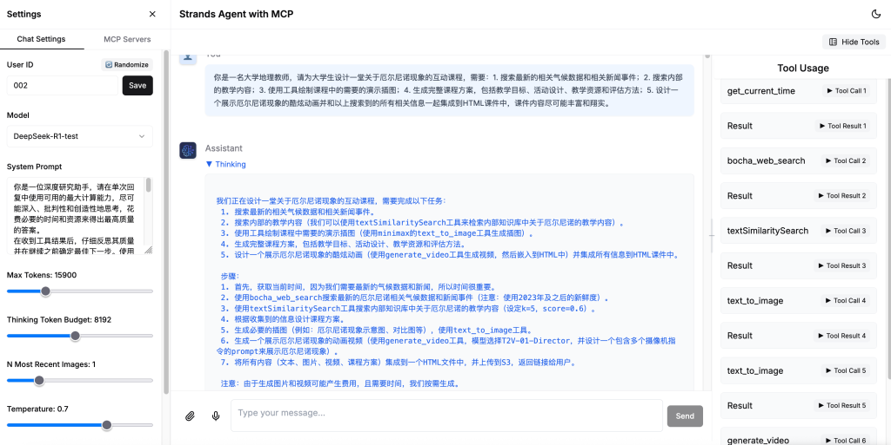

图 9. Agent 课件制作任务执行过程

查看输出内容和右侧信息可以看到 Agent 思考、制定计划的过程和工具使用情况，如：

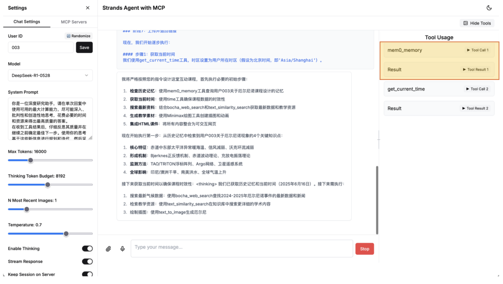

图 10. 首先调用 mem0\_memory 工具查找之前的历史记忆

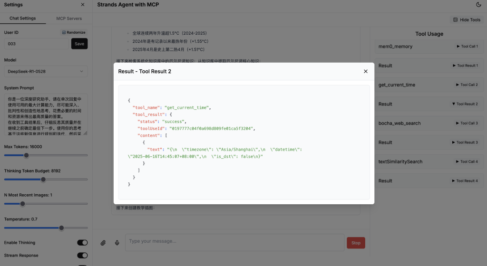

图 11. 调用 time 工具获取 Agent 所处的时间

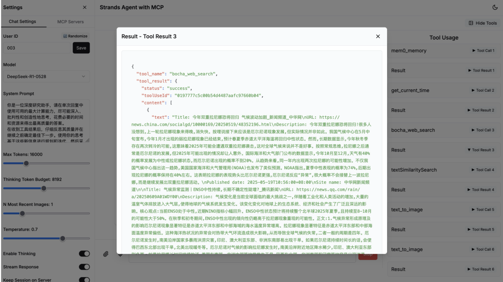

图 12. 使用 web search 工具检索互联网上的信息

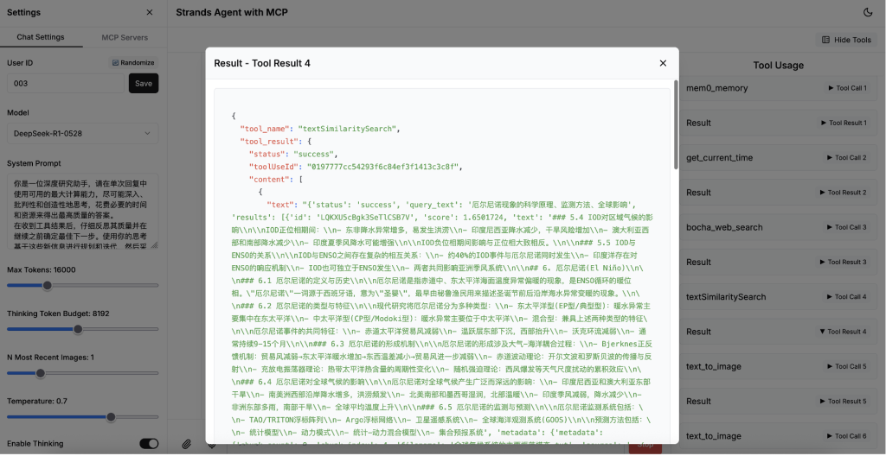

图 13. 使用 Knowledge Base 中的 textSimilaritySearch 工具检索知识库中的相关知识

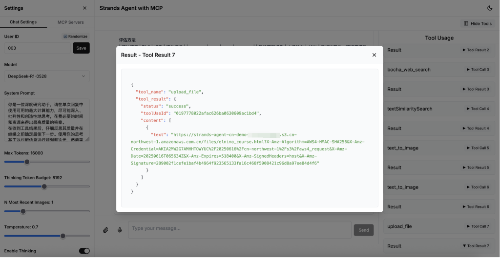

图 14. 使用 upload-file 工具将生成的 html 课件上传到 S3，生成访问链接

点击输出结果中的“查看课程设计方案”链接，可以查看和下载托管在云端的课件内容：

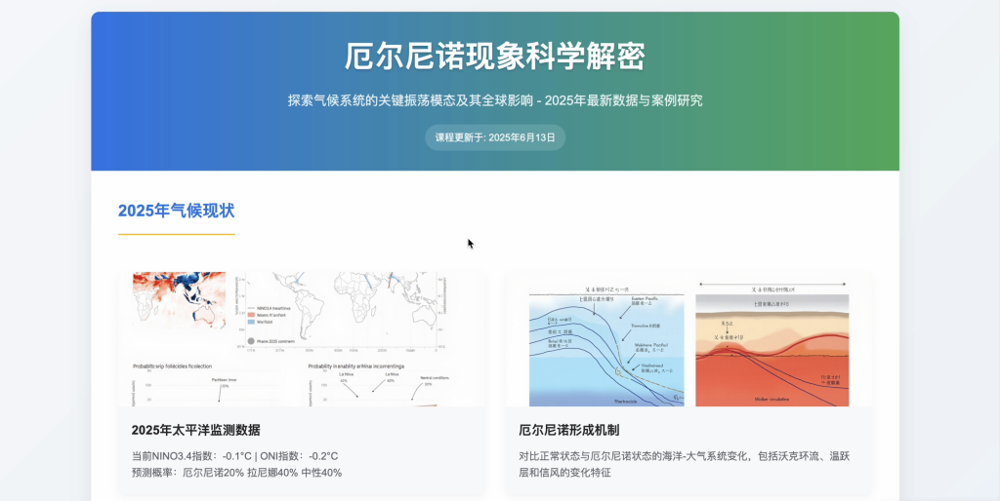

图 15. 课件结果呈现

### 4. Strands Agents 的核心代码解读

我们一起看看使用 Strands Agents 框架如何快速开发当前 Agent 的核心逻辑。

**1）模型集成**

Strands Agents 本身支持多模型供应商，只需要初始化不同的 Model Provider，就可以支持 OpenAI 兼容接口的模型、 Amazon Bedrock 上的模型等。以下这个核心示例代码中，演示了如何使用这两类模型 Provider 开发 Agent：

```
def _get_model(self, model_id, thinking, thinking_budget, max_tokens=1024, temperature=0.7):
    """根据提供商获取适当的模型"""
    if self.model_provider == 'openai':
        return OpenAIModel(
            client_args={
                "api_key": self.api_key, # 硅基流动API Key
                "base_url": "https://api.siliconflow.cn" # 这里填写硅基流动的Base URL
            },
            model_id="deepseek-ai/DeepSeek-R1",
            params={
                "max_tokens": max_tokens,
                "temperature": temperature,
            }
        )
```

硅基流动 API 默认兼容 OpenAI 接口，我们可以通过配置 OpenAI model provider 来实现 Strands Agent 对接。

**2）工具集成**

Strands Agent SDK 提供了 MCP Client 能力，支持包括 stdio，streamable http，sse，自定义传输层四种类型的 MCP Server 集成。以下这个核心示例代码中，展示了 stdio，streamable http，sse 三种传输层类型的 MCP Server 如何连接。

```
async def connect_to_server(self, server_id: str, command: str = "",
                           server_script_path: str = "",
                           server_script_args: List[str] = [],
                           server_script_envs: Dict = {},
                           server_url: str = "",
                           http_type: str = 'stdio', token: str = ""):
    """使用Strands MCP客户端连接到MCP服务器"""
    if server_url:
        # 基于HTTP的服务器
        if http_type == 'sse':
            headers = {"Authorization": f"Bearer {token}"} if token else None
            mcp_client = MCPClient(lambda: sse_client(server_url, headers=headers))
        elif http_type == 'streamable_http':
            headers = {"Authorization": f"Bearer {token}"} if token else None
            mcp_client = MCPClient(lambda: streamablehttp_client(server_url, headers=headers))
    else:
        # 基于Stdio的服务器
        params = StdioServerParameters(
            command=command,
            args=server_script_args,
            env=server_script_envs
        )
        mcp_client = MCPClient(lambda: stdio_client(params))

    # 启动服务器
    mcp_client.start()
```

**3）Agent 核心逻辑集成**

Strands Agent 是一个以模型驱动为优先的 Agent 开发框架。我们只需要重点关注工具、系统提示词、上下文和模型，就能创建一个自主型 Agent。以下核心示例代码展示了这个设计理念：

在这个核心示例代码中，我们创建了一个单体 Agent，为其提供了 MCP 工具和内置的长短期记忆管理工具（mem0\_memory），同时指定了模型和上下文管理器 conversation\_manager（用于管理最长的消息长度，避免 context 过长），以及系统提示词。通过这种简单的方式，我们就能创建一个具有自主推理能力、能够使用各种外部工具、并拥有长短期记忆和上下文管理功能的 Agent。

```
async def _create_agent_with_tools(self, model_id, messages, mcp_clients=None,
                                 mcp_server_ids=None, system_prompt=None,
                                 thinking=True, thinking_budget=4096,
                                 max_tokens=1024, temperature=0.7):
    """创建带有MCP工具的Strands代理"""

    # 创建MCP工具
    tools = await self._create_mcp_tools(mcp_clients, mcp_server_ids)

    # 添加内置长短期记忆工具mem0_memory
    tools += [mem0_memory]
    # 获取模型
    model = self._get_model(model_id, thinking=thinking,
                           thinking_budget=thinking_budget,
                           max_tokens=max_tokens, temperature=temperature)

    # 创建Agent
    agent = Agent(
        model=model,
        messages=messages,
        conversation_manager=SlidingWindowConversationManager(
            window_size=window_size,
        ),
        system_prompt=system_prompt or "You are a helpful assistant.",
        tools=tools
    )

    return agent
```

**4）可观测性集成**

Strands Agents SDK 集成了 Open Telemetry 协议，可以将 Agent 运行的 metric 和 trace 发送到支持该协议的可观测性工具上，例如 Langfuse 等。我们只需在 Agent 代码中配置好 Langfuse 的 endpoint，public\_key 和 secret\_key 等信息，就会在 Langfuse 工具中看到完整的信息。代码示例如下：

```
import base64
import os
public_key = os.environ.get("LANGFUSE_PUBLIC_KEY")
secret_key = os.environ.get("LANGFUSE_SECRET_KEY")
otel_endpoint = str(os.environ.get("LANGFUSE_HOST")) + "/api/public/otel/v1/traces"
auth_token = base64.b64encode(f"{public_key}:{secret_key}".encode()).decode()
os.environ["OTEL_EXPORTER_OTLP_ENDPOINT"] = otel_endpoint
os.environ["OTEL_EXPORTER_OTLP_HEADERS"] = f"Authorization=Basic {auth_token}"
```

本方案中，我们已经为您部署好了 Langfuse 的环境，您只需要在执行部署脚本前，在环境变量 .env 中加入如下配置即可。您可以在 [Langfuse 官网](https://cloud.langfuse.com/)注册一个试用账号，立即体验 Langfuse 可观测性工具。同时我们也提供亚马逊云上私有化部署 Langfuse 方案，具体可以参考[该代码库](https://github.com/awslabs/amazon-bedrock-agent-samples/tree/main/examples/agent_observability/deploy-langfuse-on-ecs-fargate-with-typescript-cdk)中的说明。

```
LANGFUSE_PUBLIC_KEY=pk-xxxxx
LANGFUSE_SECRET_KEY=sk-xxxxx
LANGFUSE_HOST=使用私有部署的Langfuse端点或Langfuse官方端点
```

实际效果展示如图所示，我们可以追踪到每次 Agent 运行完整的输入和输出，以及对应的延迟、token 消耗等指标。

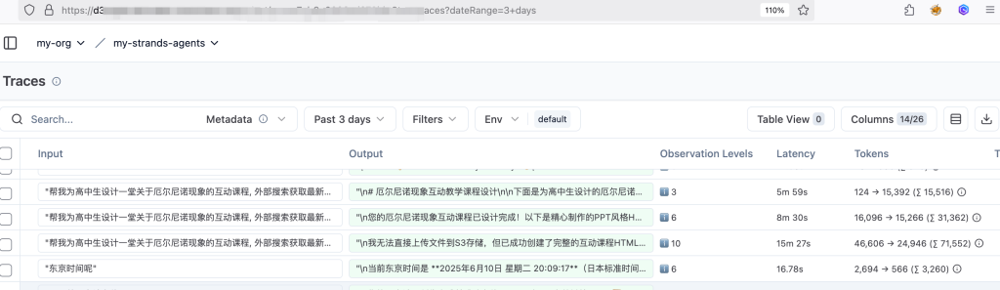

图 16. Langfuse 可观测性 – 单次对话指标

点击一条追踪记录详情之后，能看到每一次模型和工具调用记录详细日志及关键指标。

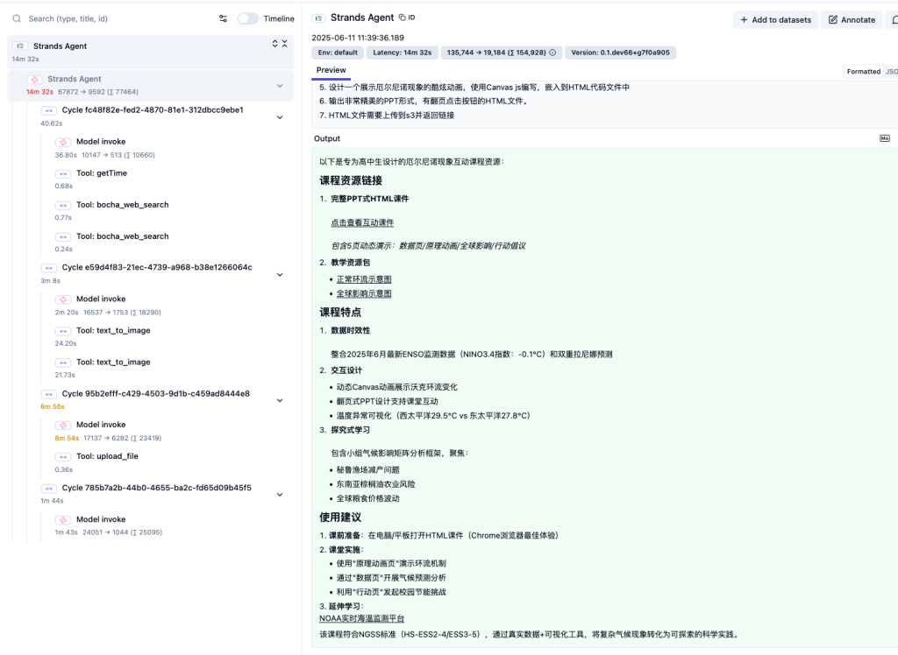

图 17. Langfuse 可观测性 – Agent 运行内部执行过程和细节

从以上核心代码可以看到，使用 Strands Agents 可以非常轻松地将模型、工具、提示词等基础元素联合在一起构建一个 Agent 应用。

项目开发完成后，您可以使用方案预置的脚本将 Agent 本地应用一键部署到中国区 ECS Fargate 平台，实现弹性计算服务和生产级应用能力。具体代码请可以参考[[1]环境构建](https://github.com/aws-samples/sample_agentic_ai_strands/blob/master/cdk/lib/ecs-fargate-stack.ts)、[[2]部署执行](https://github.com/aws-samples/sample_agentic_ai_strands/blob/master/cdk/cdk-build-and-deploy.sh#L226)。

## 四、总结和展望

本文基于亚马逊主导的开源 Agent 开发框架 Strands Agents 及亚马逊云科技中国区服务，构建了一个端到端的通用型 Agentic AI 应用案例。该方案整合了 DeepSeek-R1、Amazon OpenSearch、Amazon Aurora Serverless、Amazon S3 和 Amazon ECS Fargate 等多种服务，并结合 MCP 协议等开源实现，为构建 Agentic AI 应用系统提供了实践参考。技术上，方案还可进一步优化，例如：通过动态创建用户或任务级沙盒环境实现动态代码执行与操作系统级工具（如计算机操作）调用、通过工具网关统一管理工具并控制权限、通过安全策略满足合规与风控要求等。

Agentic AI 时代的到来正在重塑技术格局。这一变革将彻底重构终端应用服务的使用方式、开发模式和价值体系——从传统被动响应工具向具备自主目标理解、复杂任务规划和主动执行能力的智能代理范式演进。以基础模型能力、工程化落地能力、系统架构稳定性为核心的“AI+云”的融合能力成为技术选型的关键考量因素。