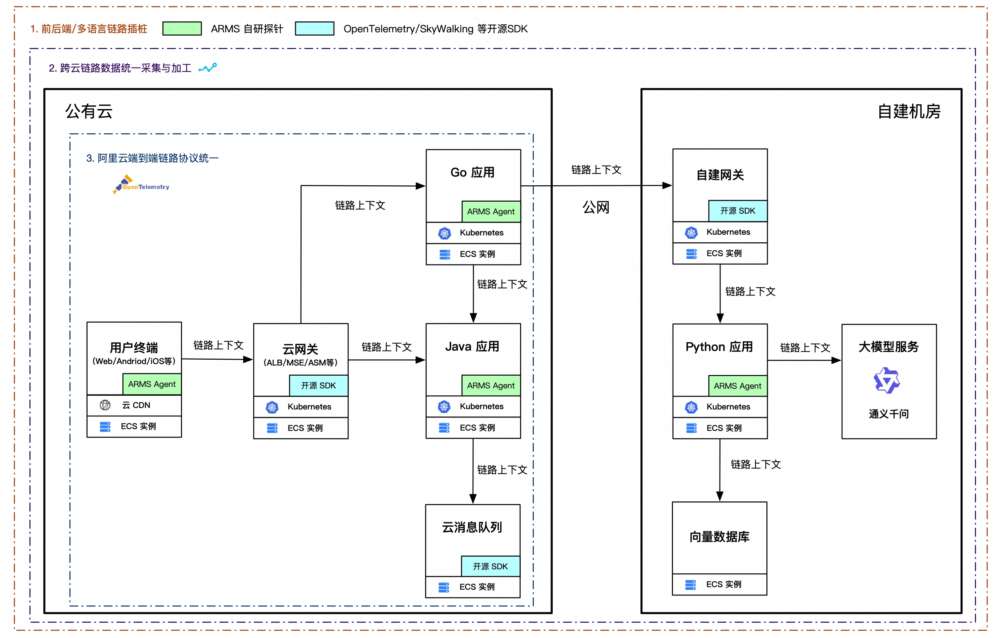
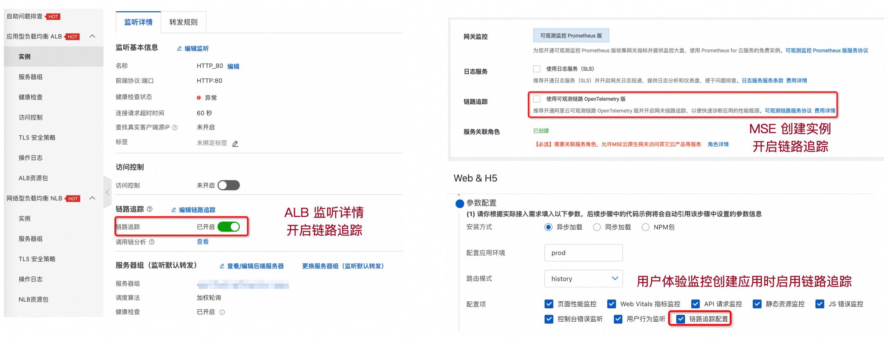
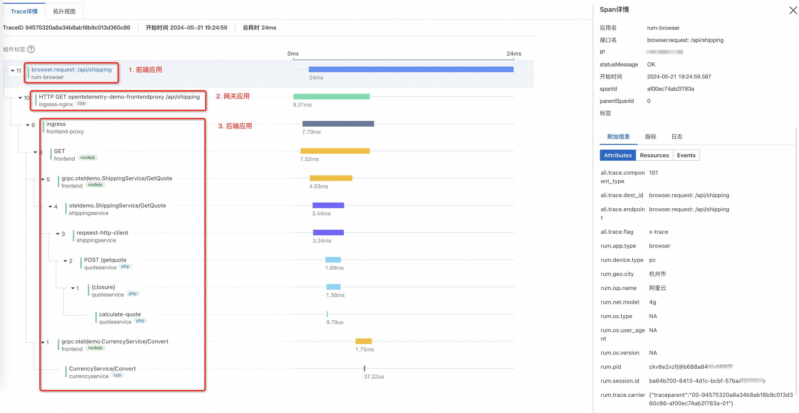
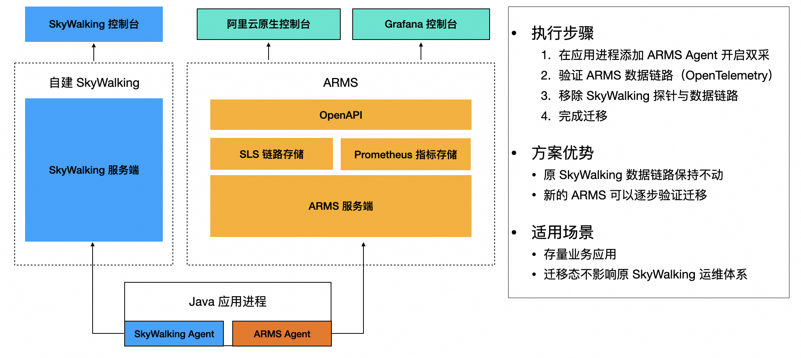

# 阿里云端到端链路追踪最佳实践

链路追踪的核心价值在于“连接”，用户终端、网关、后端应用、依赖组件（如数据库、消息、大模型）等共同构成了链路追踪的轨迹拓扑大图。这张拓扑覆盖的范围越广，链路追踪能够发挥的价值就越大。而端到端链路追踪就是覆盖全部关联 IT 系统，能够完整记录用户行为在系统间调用路径与状态的最佳实践方案。

## 阿里云端到端链路追踪解决方案

阿里云 ARMS（含可观测链路 OpenTelemetry 版）目前已经支持用户终端（Web/Android/iOS等）-> 云网关（ALB/MSE/Ingress/ASM等）-> 后端应用（Java/Go/Python/.NET等）-> 云组件（数据库、消息、大模型等）的端到端全链路打通，如下图所示。

### 链路插桩：Java/Go/Python等主流语言推荐 ARMS 自研探针，兼容开源提升多语言覆盖度

针对 Java/Go/Python 等主流语言，推荐接入 ARMS 自研探针提升链路插桩的质量、性能、稳定性和易用性。同时，为了更广泛的支持其他语言，可观测链路 OpenTelemetry 版全面兼容 OpenTelemetry、SkyWalking、Zipkin和Jaeger 4 种主流链路框架以及10+ 种多语言的链路插桩与数据上报，如下表所示。

ARMS 与可观测链路 OpenTelemetry 版数据完全互通，在多语言场景建议结合使用。

| **编程语言** | **ARMS 应用监控**  **（自研探针，SLA 有保障）** | **可观测链路 OpenTelemetry 版**  **（开源客户端，自行管理）** | **推荐接入方式** |
| --- | --- | --- | --- |
| Java         | 自动埋点                                        | 自动埋点                                                     | ARMS             |
| Go           | 自动埋点                                        | 自动埋点                                                     | ARMS             |
| Python       | 自动埋点                                        | 自动埋点                                                     | ARMS             |
| Node.js      | 不支持                                          | 自动埋点                                                     | OpenTelemetry    |
| .NET         | 不支持                                          | 自动埋点                                                     | OpenTelemetry    |
| PHP          | 不支持                                          | 自动埋点                                                     | OpenTelemetry    |
| Erlang       | 不支持                                          | 自动埋点                                                     | OpenTelemetry    |
| C++          | 不支持                                          | 手动埋点                                                     | OpenTelemetry    |
| Swift        | 不支持                                          | 手动埋点                                                     | OpenTelemetry    |
| Ruby         | 不支持                                          | 手动埋点                                                     | OpenTelemetry    |
| Rust         | 不支持                                          | 手动埋点                                                     | SkyWalking       |

ARMS 2024年发布的 JavaAgent 4.0，全面拥抱 OpenTelemetry 生态，探针底座基于 OpenTelemetry 框架进行了全新升级，并额外提供多种资源监控、性能诊断、应用安全等数据。除了更丰富的数据，ARMS JavaAgent 4.0 还支持更加灵活的调用链采样策略、白屏化探针管理、全方位自监控、动态功能降级等高阶特性，更加适合企业级客户的生产环境应用。

### 链路采集与加工：深度集成阿里云生态，云产品链路一键接入

企业上云的一个痛点问题就是重度依赖云产品服务可用性，端到端链路追踪可以快速定位错慢请求异常节点，提升故障快恢效率，降低业务损失。那么如何接入云产品的调用链路数据呢？

可观测链路 OpenTelemetry 版与阿里云近10款云产品深度合作，完成了云产品内部链路插桩与数据上报。对于企业用户来说，只需在相应的云产品控制台一键启用链路追踪开关，就可以直接看到相应的调用链，大幅简化了链路采集成本，ALB 网关、MSE 网关以及 ARMS 用户体验监控的链路追踪接入效果如下图所示 。

受限于产品特性，不同云产品的链路插桩方案有所区别，配套的链路数据采集大致分为两类：

- Trace 直接/转发上报：以用户体验监控为例，内部实现链路插桩与 Exporter 直连上报，埋点更精细更灵活。
- 日志数据转 Trace：以 ALB 网关为例，后台消费访问日志，再转义成 Trace 数据，侵入性更小。

两种方案各有优劣，通常推荐 Trace 直连/转发上报，此种方案更规范。但是在性能要求高或者旧系统改造困难场景下，可以考虑日志转 Trace（前提条件是在日志中添加 TraceId 等链路上下文）。

目前，已经支持接入链路追踪的云产品、协议及接入指南如下表所示。

| **接入类别** | **接入端** | **接入指南** | **支持协议** |
| --- | --- | --- | --- |
| 用户终端                         | Web/H5/小程序                                                | [Web端监控关联前后端Trace](/help/zh/arms/user-experience-monitoring/use-cases/trace-associated-with-rum-monitoring) | w3c、b3、jaeger、skywalking              |
| Android/iOS                      | [App监控关联前后端Trace](/help/zh/arms/user-experience-monitoring/use-cases/mobile-association-trace) | w3c、skywalking                                              |                                          |
| 网关                             | MSE                                                          | [开启网关链路追踪](/help/zh/mse/user-guide/enable-tracing-analysis-for-a-cloud-native-gateway) | w3c、b3、skywalking                      |
| ACK Ingress                      | [实现Nginx Ingress Controller组件的链路追踪](/help/zh/arms/tracing-analysis/implement-link-tracing-of-the-nginx-ingress-controller-component) | w3c、b3、jaeger                                              |                                          |
| ALB                              | [通过ALB链路追踪实现业务全链路分析](/help/zh/slb/application-load-balancer/use-cases/untitled-document-1698045154408) | b3                                                           |                                          |
| ASM                              | [在ASM中实现分布式跟踪](/help/zh/asm/sidecar/enable-distributed-tracing-in-asm) | b3                                                           |                                          |
| API Gateway                      | [配置Trace链路追踪](/help/zh/api-gateway/traditional-api-gateway/user-guide/configure-tracing-analysis) | b3                                                           |                                          |
| 后端应用                         | Java/Go/Python（自研）                                       | [应用监控接入概述](/help/zh/arms/application-monitoring/user-guide/overview) | w3c、b3、jaeger、  skywalking、eagle eye |
| .NET、Node.js 等  多语言（开源） | [接入指南](/help/zh/arms/tracing-analysis/tutorials/)        | w3c、b3、jaeger、  skywalking                                |                                          |
| 依赖组件                         | 100+ 插件支持，覆盖 RPC、消息队列、数据库、任务调度等各种类型。 |                                                              |                                          |

### 链路上下文透传：统一阿里云端到端链路协议，自研探针兼容多协议转换

从单个应用组件的视角，完成链路插桩和数据采集，能在控制台上看到对应的 Trace 数据就已经成功了。但是真正的端到端链路追踪必须将上下游的 Trace 以统一的协议进行串联，保证不断链，既有技术层面的挑战，也有协同层面的困难。

目前阿里云可观测已经基于 OpenTelemetry W3C 协议实现端到端链路打通，后续将逐步覆盖更多协议、更多组件的全链路透传，构建更完整、更灵活的链路生态，完整端到端调用链如下图所示。

相比于新应用接入 Trace，存量应用要实现端到端协议栈统一的挑战会更大。特别是面临新旧技术栈切换场景（比如 SkyWalking 迁移至 OpenTelemetry），既要保证存量运维体系持续可用，又要验证新体系的有效性，如何兼容两种不同链路体系共存，是影响存量应用技术栈升级或链路打通的最大难题。

为了解决这个问题，ARMS 自研探针做了大量的兼容性优化，最终实现了双探针共存，保证两套体系能够同时正确、稳定运行，直至迁移完成，如下图所示。

ARMS 自研探针支持多协议识别与透传，在某些特殊场景，如果上下游系统难以变更，可以通过 ARMS Agent 进行协议中转，比如上游 A 应用使用 Jaeger 协议 -> ARMS Agent（接收 Jaeger，向下透传 Jaeger + Zipkin B3） -> 下游 B 应用使用 Zipkin B3 协议，最终实现 TraceId 的透传与打通。